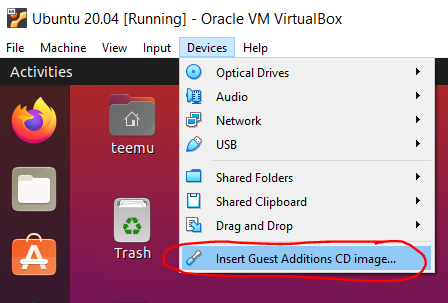

# Kurssin johdanto, ympäristöt ja Linux/Unix-komentorivi

Kurssin ensimmäisellä viikolla asennamme kurssilla tarvittavat kehitysympäristöt, tutustumme Linux-käyttöjärjestelmän peruskäyttöön.

Johdannon käytettäviin työkaluihin löydät kurssin [etusivulta](../README.md#Työkalut).


**Tulet tekemään osan ensimmäisen viikon työskentelystä itsenäisesti jo ennen lukujärjestykseen merkittyä oppituntia. Kysy kohtaamistasi ongelmista rohkeasti Teamsissa keskustelukanavalla jo ennen ensimmäistä oppituntia.**

## Ennakkotehtävät

Ennen ensimmäistä oppituntia sinun tulee valmistella itsellesi toimiva unix-pohjainen ympäristö, jossa voit kehittää ja suorittaa jatkossa kurssilla kehittämiämme koodeja. 

Mikäli sinulla on jo valmiiksi hyvä ympäristö tai olet kiinnostunut esimerkiksi, [Dockerin](https://www.docker.com/), [Raspberry Pi](https://www.raspberrypi.org/):n tai [DigitalOceanin](https://www.digitalocean.com/github-students/) käytöstä, voit käyttää myös niitä, mutta  emme voi luvata niihin käyttötukea.

### Windows + VirtualBox + Linux

Windows-käyttäjille suosittelemme Oraclen ilmaisen [VirtualBox](https://www.virtualbox.org/)-virtualisointiympäristön sekä [Ubuntu](https://ubuntu.com/)-käyttöjärjestelmän asentamista. Virtuaalikoneeseen tekemäsi asennukset eivät vaikuta tietokoneesi normaaliin käyttöön, ja käyttämällä virtuaalikonetta saat käyttötukea myös kurssin puolesta. 

Hyvä ohje asennuksiin löytyy esimerkiksi osoitteesta https://itsfoss.com/install-linux-in-virtualbox/:

> *Using Linux in a virtual machine gives you the option to try Linux within Windows. This step-by-step guide shows you how to install Linux inside Windows using VirtualBox.*
>
> https://itsfoss.com/install-linux-in-virtualbox/

Windows-käyttäjänä joudut mahdollisesti [kytkemään päälle Windowsin Hyper-V -ominaisuuden](https://docs.microsoft.com/en-us/virtualization/hyper-v-on-windows/quick-start/enable-hyper-v#enable-the-hyper-v-role-through-settings) tai [kytkemään virtualisoinnin päälle tietokoneesi BIOS-asetuksista](https://www.google.com/search?q=enable+virtualization+bios).

Mikäli virtuaalikoneen asennuksessa on ongelmia, pyritään pääsääntöisesti ratkaisemaan ne jo ennen ensimmäistä oppituntia Teams-työtilan chatissa!


### Linuxin komentorivikäyttö ja pakettien asentaminen

Ubuntussa useat paketit ja ohjelmat asennetaan komentorivityökaluilla. Komentorivin saat auki Ubuntun valikosta nimellä "Terminal", tai näppäinyhdistelmällä `CTRL + ALT + T`.

Mikäli komentorivin käyttö tuottaa ongelmia, hyvä tutoriaali komentorivin käytöstä löytyy osoitteessa https://ubuntu.com/tutorials/command-line-for-beginners.

Voit myös aina kysyä neuvoa kurssin opettajilta ja muilta opiskelijoilta kurssin Teams-kanavilla!


**APT**

Ubuntun asennustyökalu on nimeltään Advanced Package Tool eli APT:

> *APT eli Advanced Package Tool on Debian-projektin kehittämä työkalu Linux-käyttöjärjestelmän pakettienhallinnan helpottamiseen. Se huolehtii mm. asennettavien pakettien riippuvuussuhteista ja niiden päivittämisestä. Se hakee asennettavat paketit netistä. APT-nimitystä käytetään sekä paketinhallintakirjastosta (jota voi käyttää monen käyttöliittymän kautta) että sitä käyttävästä komentorivityökalusta.*
>
> Linux.fi-wiki, https://www.linux.fi/wiki/APT

APT:in avulla sovellusten asennus tapahtuu kirjoittamalla komento muodossa:

    apt install ohjelma

Koska ohjelmien asennus vaatii pääkäyttäjäoikeudet, ei normaalilla käyttäjätunnuksella voida suoraan tehdä asennuksia. Yksittäisiä komentoja saa suoritettua pääkäyttäjäoikeuksilla [`sudo`-komennon avulla](https://wiki.ubuntu-fi.org/Sudo). Käytännössä tulet siis tekemään asennukset seuraavasti:

    sudo apt install ohjelma


APT asentaa koneellesi suoritettavia ohjelmia, joiden kanssa tulee aina huomioida myös tietoturva. Pääsääntöisesti Ubuntun pakettivarastot ovat turvallisia, mutta uusien pakettivarastojen lisääminen saattaa aiheuttaa riskejä. Tällä kurssilla teemme asennuksia vain Ubuntun omista pakettivarastoista. Voit lukea aiheesta lisää artikkelista [Can I get a virus by using "sudo apt-get install"?](https://askubuntu.com/a/818022)


**PIP**

APT-komennon lisäksi Linuxille on lukuisia muita pakettienhallintaohjelmia, joista useat ovat erikoistuneet jonkin tietyn ohjelmointikielen kirjastojen asentamiseen. 

Python-kirjastojen asentamisessa käytämme `pip`-työkalua.

> *pip is the package installer for Python. You can use pip to install packages from the Python Package Index and other indexes.*
> 
> https://pypi.org/project/pip/

`pip` voidaan asentaa edellä esitellyn `apt`:in ja `sudo`:n avulla seuraavasti:

```shell
sudo apt install python3-pip
```


**Node.js ja npm**

Pythonin lisäksi tulemme tällä kurssilla ohjelmoimaan JavaScriptillä, mihin tarvitsemme Node.js:n. Node-paketeille on oma paketinhallintasovellus nimeltä **npm** (Node Package Manager). Nämä voidaan asentaa apt-komennoilla seuraavasti:

```shell
sudo apt install nodejs
sudo apt install npm
```

Halutessasi voit lisäksi konfiguroida npm:n siten, että et tarvitse pääkäyttäjäoikeuksia pakettien asentamiseen: https://blua.blue/article/how-to-install-global-npm-packages-without-sudo-on-ubuntu/

### Git-asennus

Kurssilla käytetään oppimateriaalin ja esimerkkikoodien jakelussa Git-versionhallintaa. Asenna itsellesi valmiiksi Git-työkalut. 

```shell
sudo apt install git
```

Asennuksen jälkeen voit kloonata tämän repositorion itsellesi (vapaaehtoista):

```shell
git clone https://github.com/haagahelia/swd4tn023.git
```

### Visual Studio Coden asennus

Viimeisenä asennuksena suosittelemme asentamaan Visual Studio Code -kehitysympäristön. Se löytyy ilmaiseksi helpoiten Ubuntun ohjelmistokaupasta. Ohjelmistokaupan voit avata painamalla Windows-painiketta ja kirjoittamalla hakukenttään "Ubuntu Software". Etsi hakukentän avulla "Visual Studio Code" ja valitse "install".

Visual Studio Code voidaan asentaa Linuxiin myös [lukuisilla muilla tavoilla](https://code.visualstudio.com/docs/setup/linux).

#### Laajennokset ja asetukset

Tulemme käyttämään VS Codessa ainakin seuraavia laajennoksia, jotka voit asentaa etukäteen tai tarpeen mukaan:

1. `Python`-tuki VS Codelle

    https://marketplace.visualstudio.com/items?itemName=ms-python.python

1. `Pylint` koodin tarkistus

     `pip3 install pylint`

1. `Rope` refaktorointi

     `pip3 install rope`

1. `autopep8` koodin muotoilu

    `pip3 install autopep8`

Huomaa, että pip-asennukset ovat käyttäjäkohtaisia, eli niitä ei tehdä `sudo`-komennon avulla.

Lisäksi suosittelemme muuttamaan VS Code:n asetuksista koodin automaattisen muotoilun päälle tallennettaessa ja liitettäessä koodia:

Avaa "User settings". Etsi hakukentän avulla valinnat `Format on save` sekä `Format on paste` ja aseta rastit molempiin ruutuihin.

Huom! Python-paketit sisältävät suoritettavaa ohjelmakoodia, joten niiden kanssa tulee huomioida tietoturva, aivan kuten muidenkin suoritettavien ohjelmien kanssa. Paketteja ei kannata ladata tuntemattomista lähteistä. Tunnettujen ja laajasti käytettyjen pakettien käyttäminen voi myös olla turvallisempaa kuin heikommin tunnettujen tai vähäisessä käytössä olevien. Lisätietoa pip-pakettienhallinnan turvallisuudesta löydät esimerkiksi artikkelista ["Look before you pip"](https://www.ayrx.me/look-before-you-pip).


### Extra: Guest additions sekä leikepöydän käyttö

Perusasennuksen lisäksi suosittelemme sinua asentamaan VirtualBoxin "guest additions" -lisäosat virtualisoidulle Linux-koneelle. Lisäosien avulla esimerkiksi VirtualBox-ikkunan koon muuttaminen muuttaa automaattisesti virtualisoidun työpöydän resoluutiota ikkunan koon mukaiseksi. 

Asennus tapahtuu helpoiten syöttämällä virtuaalikoneeseen virtuaalinen asennus CD virtuaalikoneen ollessa käynnissä:



Lisää ohjeita löydät [Googlella](https://www.google.com/search?q=virtualbox+install+guest+additions).

Virtuaalikoneen ja "host"-koneen välillä on myös mahdollista synkronoida leikepöytä. Tällöin pystyt kopioimaan ja liittämään tekstiä kätevästi eri järjestelmien välillä. Käynnissä olevan virtuaalikoneen "Devices"-valikosta löytyy kohta "Shared clipboard", jonka avulla voit valita leikepöydän toimintalogiikan haluamaksesi.

