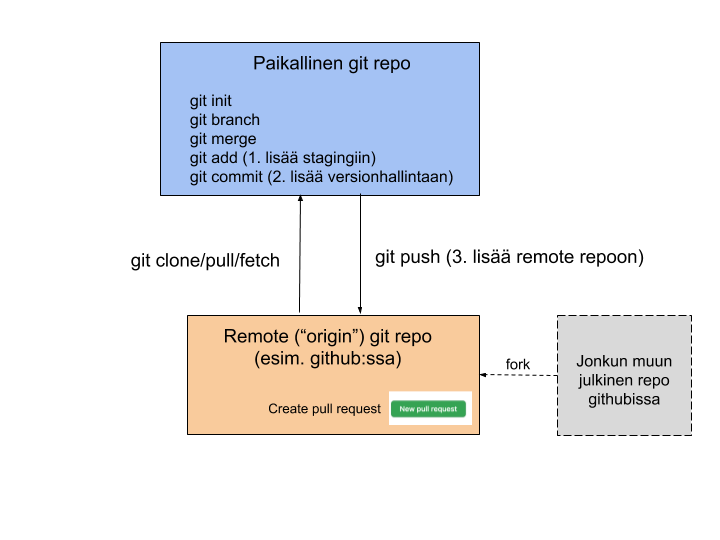
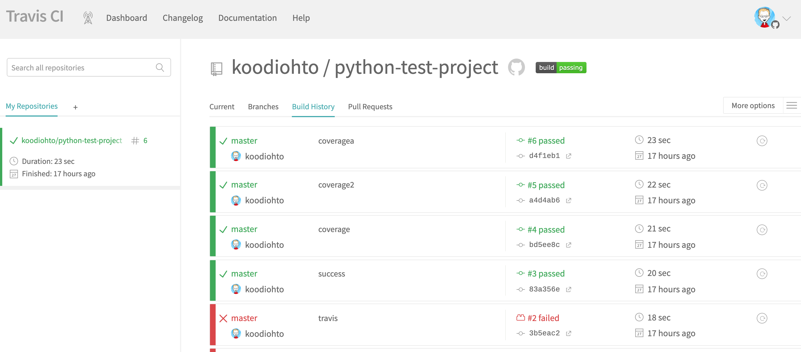
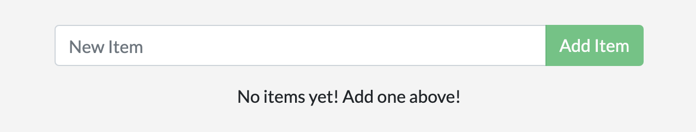
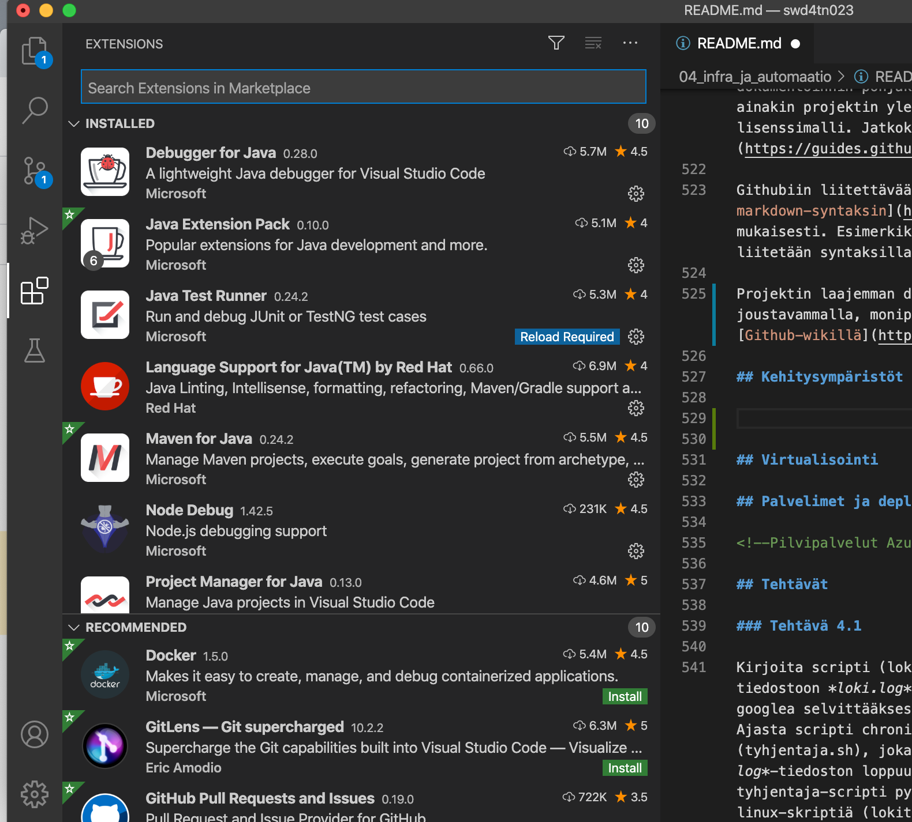
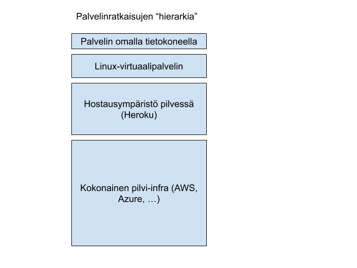
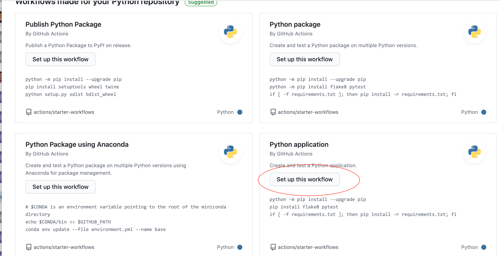
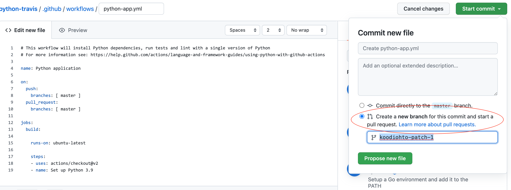
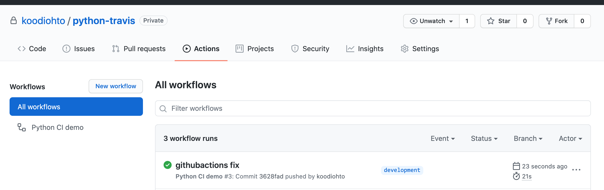
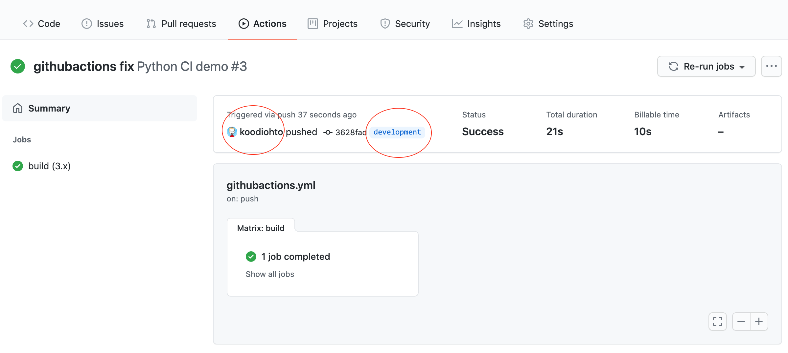
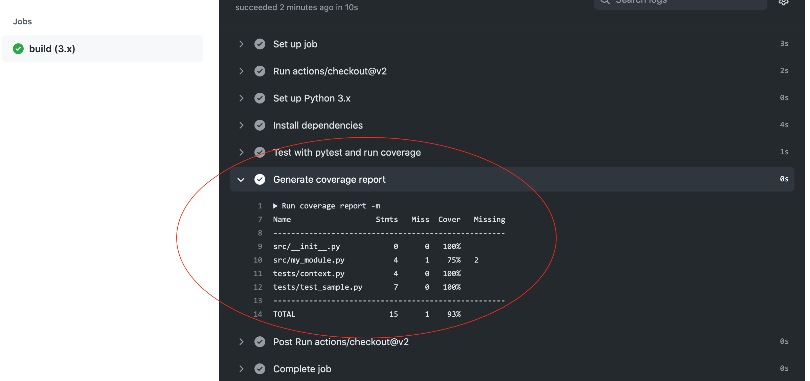

## Sisällysluettelo

* [Ohjelmistokehittäjän infra ja automaatiotyökalut](#ohjelmistokehittäjän-infra-ja-automaatiotyökalut)
* [Versionhallinta (Git) ja Github-palvelu](#versionhallinta-git-ja-github-palvelu)
* [Paketinhallinta ja buildaaminen](#paketinhallinta-ja-buildaaminen)
* [Jatkuva integrointi (CI/CD)](#jatkuva-integrointi-cicd)
* [Kontittaminen (docker)](#kontittaminen-docker)
* [Github dokumentointi](#github-dokumentointi)
* [Kehitysympäristöt ja IDEt](#kehitysympäristöt-ja-idet)
* [Palvelimet ja deployaaminen](#palvelimet-ja-deployaaminen)
* [Tehtävät](#tehtävät)

# Ohjelmistokehittäjän infra ja automaatiotyökalut

Ohjelmistokehittäjän työssä on paljon oheistyökaluja ja tekniikoita, jotka helpottavat kehitystyötä ja parantavat kehitystyön laatua. Tässä osiossa on esitelty näitä asioita.

## Luentovideot

**[Video: Johdanto Gitin ja Githubin käyttöön](https://web.microsoftstream.com/video/c13cb771-9f12-4a50-b8fa-04bf76393885)**

**[Video: Git demo](https://web.microsoftstream.com/video/e7f7d1cb-7ac2-49d1-a08f-5613d24d4989)**

**[Video: Paketinhallinta (npm), CI/CD, Docker](https://web.microsoftstream.com/video/e36de940-2634-4b5a-a09e-a2891c2a61ae)**

## Versionhallinta (Git) ja Github-palvelu

<!-- TODO: lisää maininta graafisista GIT-työkaluista -->

Varsinkin kun ohjelmistoja kehitetään tiimeissä, on tärkeää hallita ohjelmiston versiohistoriaa ja mahdollistaa kehittäjille osallistuminen kaikkien komponenttien kehittämiseen silloinkin, kun joku muu saattaa kehittää kyseistä komponenttia myös. Versionhallintasovellukset toimivat arkkitehtuuriosiossa esitellyn "Event sourcing"-periaatteen mukaan, eli versionhallintaan lisätään ("commitoidaan") aina uusi muutos, mutta siellä olevia asioita ei suoraan muokata. Näin ollen versionhallinnassa voidaan aina palata minä tahansa ajanhetkenä sovelluksessa vallinneeseen tilaan.

[Git-sovellus](https://git-scm.com/) on noussut nykyisin ylivoimaisesti suosituimmaksi versionhallintasovellukseksi. Git:iä käytetään monesti yhdessä [Github-palvelun](https://github.com/) kanssa, joka mahdollistaa Git-versionhallintarepositoryjen tallentamisen julkiseen verkkoon ja tarjoaa lisäksi muita käteviä toimintoja, kuten [pull-requestit](https://yangsu.github.io/pull-request-tutorial/#:~:text=What%20is%20a%20Pull%20Request,follow%2Dup%20commits%20if%20necessary.).

Erona ennen suositumpiin versionhallintajärjestelmiin (SVN ja CVS), git on [hajautettu versionhallintajärjestelmä](https://fi.wikipedia.org/wiki/Hajautettu_versionhallintaj%C3%A4rjestelm%C3%A4). Tämä siis tarkoittaa sitä, että jokaisella käyttäjällä on oma paikallinen "kopio", eli repository sovelluksen versionhallinnasta. Tässä omassa repositoryssä käyttäjällä on täydet oikeudet tehdä muutoksia ja hallita omaa versiohistoriaansa. Paikallisen repositoryn lisäksi yleensä käytössä on myös ns. upstream-repository (hostattuna esimerkiksi juuri githubissa), johon käyttäjä voi yrittää tarjota omia paikallisia muutoksiaan tai hakea sieltä muiden tekemiä muutoksia. Gitin ydinajatukseen kuuluu versionhallinnan kolme "tasoa": 
1. lokaalien muutosten taso
1. stagingtaso (git add) 
1. varsinainen versionhallinta (git commit)
1. (lisäksi vielä mahdollinen upstream-repon taso) (git push).

Esimerkiksi siis muutosten peruuttaminen (undo) tapahtuu eri tavalla riippuen missä tasolla muutokset ovat.



[Git-sovelluksen omassa dokumentaatiossa](https://git-scm.com/) kehutaan sen olevan helppokäyttöinen. Rehellisyyden nimissä on kuitenkin sanottava, että varsinkin kun Gittiä käytetään yhdessä remote-repositoryjen kanssa, niin koko paletti on vähintäänkin vaikea, jos ei suorastaan monimutkainen. Gitissä on lukemattomia komentoja ja saman asian voi monesti tehdä usealla eri komennolla. Gitin monipuoliseen ja tehokkaaseen käyttöön liittyy paljon käsitteitä periaatteita, joiden ymmärtämiseen menee aikaa. Gitin peruskäyttö on kuitenkin melko suoraviivaista.

Esimerkiksi Atlassian-ohjelmistoyhtiö on tehnyt gitin käytöstä [melko hyvän tutoriaalin](https://www.atlassian.com/git/tutorials/setting-up-a-repository) johon voi tutustua. Käydään tässä myös läpi Gitin peruskäytössä ohjelmoijalle oleellisimpia ydintoimintoja.

Gittiä voi käyttää myös visuaalisilla työkaluilla, jotka saattavat helpottaa sen käyttöä. Näitä ovat esimerkiksi [Source tree](https://www.sourcetreeapp.com/) tai Visual Studio coden [Git Graph -lisäosa](https://marketplace.visualstudio.com/items?itemName=mhutchie.git-graph).

```shell
# Luodaan paikallinen git-repository kansiosta, jossa nyt olemme
$ git init 

# Lisätään tiedosto staging tasolle lokaalisti
$ git add README.md

# Lisätään .-asteriksilla kaikki muuttuneet tiedostot tämän kansion alta staging tasolle.
$ git add .

#Lisätään kaikki staging tason muutokset lokaaliin versionhallintaan.
$ git commit -m "initial commit"

#git add vaiheen voi hoitaa myös -a -vivulla commit -komennossa: eli tämä on sama kuin git add + git commit
#joskin kokonaan uudet ("untracked") tiedostot pitää lisätä git add:lla edelleen.
$ git commit -a -m "second commit"

# Liitetään paikalliselle repositorylle upstream repo githubissa (tyhjä upstream-repo on luotu ensin githubissa)
git remote add origin https://github.com/YOUR-USERNAME/YOUR-REPOSITORY.git

# Lisätään kaikki paikalliset versionhallinan muutokset remote-repositoryn (eli origin) master-haaraan (branch)
$ git push origin master
$ git push # oletuksena tämänhetkinen paikallinen haara pusketaan originin samaan haaraan, 
# eli ei välttämättä tarvitse erikseen mainita origin master.

# Ladataan jokin repository githubista omalle koneelle, jos ei siis itse perusteta uutta projektia git init:llä.
$ git clone https://github.com/user/repo.git

# Päivitään kaikki upstream-repon muiden tekemät muutokset itselle nykyisessä haarassa (esim. master).
# Git pyrkii tekemään ns. fast-forward automergen, 
# mutta mikäli se ei onnistu tässä, niin git tekee omien ja muiden muutosten 
# yhdistämisestä uuden commit:in versionhallintaan 
# (ja kenties pyytää tekemään tiedostojen manuaalista yhdistämistä ensin). 
# Merge-commit pitää sitten myös pushata upstream-repoon.
$ git pull
# git pull on sama kuin: 
$ git fetch # haetaan muutokset
$ git merge # tehdään yhdistäminen paikallisiin muutoksiin

# Mergen sijaan "rebasetaan" paikalliset muutokset originin master haaran muutosten perään
$ git rebase origin/master 

# rebase-vivulla käytettynä git pull ottaa remote-repositoryn viimeisimmät muutokset ja 
# lisää lokaalit muutokset niiden "perään" versiohistoriassa. 
# Eli toisin sanoen lokaalit muutokset "rebasetaan" (ja mergataan) uudestaan 
# remote repositoryn masterin viimeisimmästä tilanteesta, 
# eikä siitä tilanteesta jolloin lokaalit muutokset ja remote-repon 
# tiet alunperin erosivat, tällöin ei synny myöskään uutta merge-committia. 
# Rebase:n etuna on versihistorian pysyminen siistinä ja lineaarisena, 
# mutta sen käyttäminen voi alkuun olla vähän outoa. 
# Tästä hieman sekavasta asiasta voi lukea lisää esim täältä: 
# https://www.atlassian.com/git/tutorials/merging-vs-rebasing
$ git pull --rebase


#Katso missä lokaalissa branchissa olet.
git branch
#Katso mitä brancheja projektin remote:ssa on.
git branch -r
# Luo uusi lokaali haara (branch) ja siirry sinne 
$ git checkout -b uusihaara
# myös tämä komentosarja tekee saman asian
$ git branch uusihaara
$ git checkout uusihaara

# Rebasea uusihaara master-haaran viimeisimpien muutokset päälle. 
$ git rebase master 
#(NOTE: Rebasekomentoa tulee kuitenkin käyttää hieman harkiten, eli 
#jos esimerkiksi rebaseat master-haaran oman haarasi perään, niin
#kellään muulla saman repon käyttäjillä master ei ole rebasettu
#sinun branchistasi ja versionhallinta sekoaa pahan kerran.)

# Pushaa uusi haara myös remote-repositoryyn
$ git push --set-upstream origin uusihaara
# Toimii lyhyemmin myös vivulla -u
$ git push -u origin uusihaara
# Tai HEAD:lla voi sanoa, että pusketaan nykyinen lokaalihaara samannimisenä
#originiin
$ git push -u origin HEAD

# Kun olet tehnyt muutoksia omassa haarassasi ja haluat yhdistää muutokset esim master-haaraan, niin
$ git checkout master # siirry master haaraan
$ git merge uusihaara # yhdistä muutokset uudesta haarasta masteriin
$ git branch -d uusihaara # poista uusihaara, jos se oli esim jollekin yhdelle featurelle, vivun -D saattaa joutua myös laittamaan.
$ git push origin --delete uusihaara #poista uusihaara remotesta myös.

# Katso mitä lokaaleja muutoksia olet tehnyt
$ git status

# Näyttää omat ja originin viimeiset commitit ennen edellistä pullia.
$ git log
# --oneline-vivulla vain commit viestit ja hash-numero.
$ git log --oneline
#--graph-vivulla näyttää committien haarautumista myös visuaalisesti.
$ git log --graph 


# Katsele riveittäin tekemiäsi lokaaleja muutoksia 
$ git diff # voit myös antaa paramterina tarkemman tiedostonimen

# Tuhoa lokaalit muutoksesi
$ git checkout . # checkout-komentoa voi käyttää näinkin..
# Tai
$ git restore muutettu_tiedosto.txt
# Jos olet jo lisännyt muutokset staginigiin git add:llä, 
# niin sitten tuhoamiseen pitää käyttää git reset komentoa.

# Jos haluat hetkeksi laittaa lokaalit muutoksesi syrjään ja palata niihin myöhemmin.
$ git stash # muutoksesi menevät stashiin ja working directorysi on tyhjä
#...tee mitä haluat... ja sitten kun haluat taas ottaa muutoksesi takaisin stashista
$ git stash apply

# Siirry tietyn commitin (hashnumero) aikana vallinneeseen tilaan, tällöin olet
#detached head modessa, eli suoraan ei kannata commitoida mitään muutoksia.
$ git checkout 8c4c448
# Palaa takaisin detached head modesta sen branchiin nykyiseen tilaan josta siirryit detachiin.
$ git checkout -

# Hae tämän haaran tietty file tietystä edellisestä commitista (hash-numerolla).
$ git checkout 8c4c448 -- ./path/file_name.txt

# Git revert komennolla voi revertoida tietyn kommitin aiheuttamat muutokset
# Revert-komento ei poista vanhaa committia vaan yrittää poistaa tietyn 
# commitin tuomat muutokset ja tehdä niistä uuden commitin. Reverttiä voi
# ajatella commitin vastakohtana. Tästä voi lukea lisää esim.
# https://www.atlassian.com/git/tutorials/undoing-changes/git-revert
$ git revert HEAD #Reverttaa viimeisin committi.

# Älä kokeile tätä kotona! Jos on jostain syystä ihan pakko, niin voit siirtää ensin lokaalin 
# repositorysi tiettyyn committiin ja sitten pakottaa myös 
# upstream-repositoryn HEAD:in osoittamaan siihen. Tämä tuhoaa mahdollisesti versiohistoriaa ja saattaa
# muutenkin sekoittaa asioita entisestään.
git reset --hard 8c4c448 # haluamasi commitin hash-numero
git push --force origin master

```

Isompien projektien versionhallintakäytöntöihin ja branching-strategiaan hyvä ja paljon käytössä oleva malli on [Gitflow](https://nvie.com/posts/a-successful-git-branching-model/). [Lisää aiheesta myös Atlassianin hyvässä dokumentaatiossa](https://www.atlassian.com/git/tutorials/comparing-workflows/gitflow-workflow).

## Paketinhallinta ja buildaaminen

Ohjelmistoilla on tyypillisesti kymmeniä riippuvuuksia erilaisiin 3rd party kirjastoihin. Lisäksi ohjelmiston buildaaminen on monesti monivaiheinen prosessi, jossa esimerkiksi ensin halutaan alustaa testausympäristö (vaikka testitietokanta), ajaa yksikkötestit, pystyttää testiserveri, ajaa integraatiotestit, tappaa testiserveri, deployata buildattu projekti staging-ympäristöön jne. Näitä tarpeita ratkaisemaan on syntynyt lukuisa määrä paketinhallinta- ja buildaus-työkaluja, kuten [npm](https://docs.npmjs.com/about-npm/) Node.js:lle, [Maven](https://maven.apache.org/) ja [gradle](https://gradle.org/) Javalle, [pip](https://pypi.org/project/pip/) pythonille, [grunt](https://gruntjs.com/) Javascriptille, jne.

Käsitellään tässä lyhyesti paketinhallintaa ja buildausprosessin automatisointia npm:ää esimerkkinä käyttäen. Muut yllä mainitut työkalut toimivat melko samankaltaisia periaatteita noudattaen ja tärkeintä onkin ymmärtää mitä niillä voi ja kannattaa tehdä ja sitten tarvittaessa googlettaa, miten se jollain tietyllä työkalulla tehdään.

Npm on ensisijaisesti paketinhallintasovellus (omilla sivuillaan he käyttävät termiä "worlds largest software registry"). Npm:n avulla on siis helppo ladata muiden luomia ohjelmistokirjastoja npm:n "keskusrepositorystä". Myös pakettien julkaiseminen itse on hyvin helppoa. Esimerkiksi siis [express-kirjaston](https://www.npmjs.com/package/express) voi ladata itselleen käyttöön npm:n install-komennon avulla:

<!--Demotaan npm-komentoja ja näytetään package.json:in sisältöä lyhyesti -->

```shell
$ npm install express
```

Tätä ennen projektista on pitänyt tehdä npm-projekti ajamalla komento (ja vastaamalla kysymyksiin joita komento esittää):
```shell
$ npm init
```

*npm init* Komento luo projektiin package.json-tiedoston, jonka perusteella npm osaa hallita projektia ja sen kirjastoriippuvuuksia. npm init:in jälkeen package.json näyttää suurin piirtein tältä:

```shell
{
  "name": "npmtesti",
  "version": "1.0.0",
  "description": "npm projekti",
  "main": "index.js",
  "scripts": {
    "test": "mocha test"
  },
  "keywords": [
    "node",
    "npm"
  ],
  "author": "Ohto Rainio",
  "license": "MIT"
}
```

Kirjastoriippuvuuksia asentaessa hyvä käytäntö on määritellä tarkka versionumero kirjastosta (yleensä se on viimeisin stabiili versio). npm:ssä tämä onnistuu kätevästi *--save-exact*-vivulla. Versioiden päivittäminen aiheuttaa monesti yllättäviä ongelmia ja ohjelman rikkoutumisen. Versioiden päivittäminen tehdään siis mieluummin hallitusti ja harkitusti silloin kuin itse valitaan.

```shell
$ npm install express --save-exact
```

Tämä komento lisää expressin viimeisen stabiilin version riippuvuuden package.json-tiedostoon:

```shell
...
"dependencies": {
    "express": "4.17.1"
  }
....
```

npm hallinnoi paketteja tietyn projektin alla *node_modules*-kansiossa, johon se siis tallentaa esimerkiksi express-kirjaston tiedostot yllä olevassa esimerkissä. Lisäksi *-g*-vivulla npm asentaa paketteja käyttäjän kotihakemistoon "globaaliin" node_module-kansioon.

Kirjastoriippuvuuden voi poistaa *uninstall*-komennolla:

```shell
$ npm uninstall express
```

Kirjastoriippuvuudet, jotka olisi mahdollista päivittää uudempaan versioon voi tarkistaa:

```shell
$ npm outdated 
```

Päivittämisen voi tehdä:
```shell
$ npm update express 
```

npm:n avulla voi myös suorittaa erilaisia buildaukseen liittyviä toimenpiteitä. Esimerkiksi testaamiseen liittyen voi asentaa mocha-kirjaston:

```shell
#asennetaan --save-dev-vivulla vain development-riippuvuutena devDependencies-haaran alle, 
#eli itse sovellus ei tarvitse tätä pakettia välttämättä pyöriäkseen.
$ npm install --save-dev mocha
```

Lisätään package.json:iin skriptin nimeltä "test" ja se ajaa komennon "mocha"
```shell
...
  "scripts": {
    "test": "mocha"
  }
...
```
Ajetaan package.json:in test-skripti, joka siis ajaa mocha-testit.
```shell
$ npm test
```

Buildaustoimenpiteitä voi konfiguroida myös tarkemmin package.json:issa. Alla olevassa esimerkissä ajetaan testiä ennen start-skripti, jolla käynnistetään node-serveri ja testin jälkeen se sammutetaan toisella skriptillä.:

```shell
...
  "scripts": {
    "test": "mocha",
    "build": "babel ServerCodeFolder -s -d dist",
    "pretest": "npm start",
    "posttest": "npm stop",
    "prestart":"echo 'starting server'"
    "poststop":"echo 'stopping server'"
    "start": "npm run build && node dist/server.js",
    "stop": "node server.stop.js"
    "omaskripti": "echo 'hello world'"
  }
...
```

Kaikki mahdolliset npm-skriptit on listattu [täällä](https://docs.npmjs.com/misc/scripts). Omiakin skriptejä voi määritellä, ne pitää ajaa kommenolla
```shell
$ npm run omaskripti
```

[Omien pakettien julkaiseminen npm-repositoryyn on myös naurettavan helppoa](https://zellwk.com/blog/publish-to-npm/)! Tarvitset vain [npm-tunnuksen](https://www.npmjs.com/signup) ja sitten:
```shell
$ npm login
$ npm publish
```

## Jatkuva integrointi (CI/CD)

Jatkuva integrointi (Continuous integration) tarkoittaa oleellisesti sitä, että kun uutta koodia ajetaan versionhallintaan, niin sille suoritetaan samantien erilaisia laatutarkistuksia. Tyypillisesti ajetaan siis järjestelmän yksikkö- ja integraatiotestit ja lisäksi voidaan tehdä esimerkiksi staattista koodianalysointia, automaattista testausta eri käyttöjärjestelmäympäristöissä, suorituskykytestausta yms. Jatkuvan integroinnin avulla nähdään nopeasti jos uusi koodimuutos on rikkonut jotain tai ei muuten ole laadultaan hyväksyttävä. Joillain tiimeillä on työtilassaan esimerkiksi jatkuvasti kaikille näkyvä "radiaattori"-ruutu, josta voi tarkistaa viimeisimmän buildauksen tilan.

Jatkuvan integroinnin työkaluja on tarjolla useita. [Jenkins](https://www.jenkins.io/) on kenties suosituin jatkuvan integroinnin mahdollistava automaatiopalvelinympäristö isoissa projekteissa. Jenkinsiin on tarjolla lukuisia plugineita. Myös esimerkiksi JetBrainsin [TeamCity](https://www.jetbrains.com/teamcity/) on vastaava tuote. [Travis CI](https://travis-ci.org/) on kätevä CI-työkalu käytettynä yhdessä Githubin tai Bitbucketin kanssa. Sen voi konfiguroida buildaamaan projektin aina kun githubiin tulee uuttaa koodia ja tarvittaessa deployaamaan uusimman buildin herokuun automaattisesti. Buildin jälkeen Travis voi esimerkiksi postata tiimin slack-kanavalle viestin buildin onnistumisesta. Tämän kurssin harjoituksessa käytämme Githubiin suoraan integroituvaa [Github Actionsia](https://docs.github.com/en/actions).

 

Jatkuvalla toimituksella (Continuous deployement) tarkoitetaan prosessia ja työkaluja, joilla voidaan automatisoida hyväksytyn buildin siirtäminen suoraan tuotantoon asti. Esimerkiksi [Nexus repositoryn hallinta](https://www.sonatype.com/nexus/repository-pro) on työkalu liittyen Continuous deploymenttiin Java-maailmassa. Toimitusputken automatisoiminen toimimaan mahdollisimman saumattomasti ja pienellä viivellä kehittäjän tekemästä koodista loppukäyttäjän hyödyntämäksi ominaisuudeksi on ketterän ja leanin kehitysfilosofian mukaista toimintaa. Tätä toimintasmallia kuvaava termi Devops (development and operations) on saavuttanut suurta suosioita IT-alalla viime vuosina.

<!--Demotaan travista oman travis-projektin kautta (travis-ci.org:ssa privaatti python-repo)-->

## Kontittaminen (docker)

<!--
https://www.docker.com/101-tutorial

https://labs.play-with-docker.com/

docker run -dp 80:80 docker/getting-started:pwd

Sitten klikataan port 80 kuvaa, niin aukeaa uusi tutoriaali ->

-->

[Docker-konttityökalulla](https://www.docker.com/) on mahdollista luoda omia muusta käyttöjärjestelmästä eristettyjä "kontteja", jotka sisältävät kaiken tarpeellisen, jotta kontti voi pyöriä itsenäisesti. Dockerilla rakennettuja kontteja on sitten helppo siirtää pyörimään esimerkiksi omalta kehityskoneelta johonkin muuhun paikaan, kuten esimerkiksi aws:än pilveen. Kontittamisen avulla ei tarvitse konfiguroida asioita uudestaan uudessa ympäristössä, vaan kontti sisältää jo alunperin kaikean tarpeellisen pyöriäkseen itsenäisesti missä paikassa vain, joka osaa pyörittää docker-kontteja. 

Konttien avulla on helppo jaella siis valmiita ohjelmia, joita muut sitten voivat käyttää helposti. Esimerkiksi mikropalveluarkkitehtuureissa sovellusten eri komponenttien jakeleminen konteissa on yleinen tapa.

Dockerin [voi asentaa esimerkiksi Ubuntille](https://docs.docker.com/engine/install/ubuntu/), mutta sen asentaminen virtualbox-ympäristöön saattaa vaatia hieman jumppaamista, joten suosittelemme tällä kurssilla käyttämään testailuun ensisijaisesti [dockerin tarjoamaa lab-ympäristöä](https://labs.play-with-docker.com/). Docker. Lab-ympäristön perustutoriaalissa pääsee liikkeelle [täältä](https://www.docker.com/101-tutorial) (Play with docker-otsikon alta). Jos seminaarivaiheessa haluaa keskittyä dockeriin, niin silloin se pitänee asentaa itselleen.

<!--Demossa tiputetaan app.zip-sovellus dockerin labympäristöön ja luodaan Dockerfile app-kansioon, sitten ajetaan tämän githubsivun . Lab ympäristössä ajetaan: docker run -dp 80:80 docker/getting-started:pwd tästä lähtee tutoriaali: https://www.docker.com/101-tutorial-->

Docker-kontit määritellään *Dockerfile*:issä, joka voi näyttää esimerkiksi seuraavalta yksinkertaiselle node-sovellukselle (kansiossa /app siis sijaitsee rakentamamme node-sovellus):

```docker
FROM node:10-alpine
WORKDIR /app
COPY . .
RUN npm install
CMD ["node", "/app/src/index.js"]
```
Uuden kontin voi tämän jälkeen rakentaa komennolla:

```shell
$ docker build -t docker-sovellus .
```

Tässä tapauksessa kontin rakentaminen ottaa pohjaksi Dockerfile:ssä määrittelemämme node:10-alpine-imagen (joka sisältää mm. npm paketinhallinan, noden jne). Sitten se kopioi konttiin /app-kansion sisällön ja ajaa kontissa komennon *npm install*.

Tämän jälkeen kontin voi käynnistää:

```shell
$ docker run -dp 3000:3000 docker-sovellus
```
Komento siis ajaa Dockerfilessä CMD-rivillä määritellyn komennon eli *node /app/src/index.js*. Näin kontissa pyörii node sovellus ja voimme avata selaimessa osoitteen *localhost:3000/* ja näemme kontissa pyörivän node-sovelluksen etusivun!

 

Tällä sovelluksella ei ole vielä minkäänlaista omaa kiinteää tallennuspaikkaa, eli sovelluksen tallentamat asiat häviävät kun kontti sammutetaan. Kontin sammuttaminen tapahtuu:

```shell
#Katso kontin ID
docker ps
#sammuta kontti tietyllä ID:llä
docker stop <ID>
#poista sammutettu kontti
docker rm <ID>
```

Jos kontin tallentamaa dataa haluaa säilyttää, niin kontille voidaan luoda "volume", jota docker hallinnoi ja joka siis käytännössä tallentaa docker-kontin asioita paikalliselle levylle.

```shell
#luo volume
docker volume create todo-db
#käynnistä kontti uudestaan volumen kanssa
docker run -dp 3000:3000 -v todo-db:/etc/todos docker-sovellus
```

Docker kontteja voi julkaista [docker-hubissa](https://hub.docker.com/) samantapaisesti kuin githubiin voi julkaista koodia. Tämä tapahtuu *docker push*-komennolla sen jälkeen kun olet luonut uuden repositoryn docker-hubissa. Tähän prosessiin voi tutusta tarkemmin [dockerin omassa tutoriaalissa](https://labs.play-with-docker.com/). Docker-hubista löytyy valmis docker-image esimerkiksi [MySQL-kannalle](https://hub.docker.com/_/mysql) tai [Node-RED:lle](https://hub.docker.com/r/nodered/node-red), jonka voi siis vain ajaa käyntiin komennolla *docker run*.

```shell
docker run -it -p 1880:1880 --name mynodered nodered/node-red
```

<!--
node.js + react sovelluksen dockerointi: https://medium.com/bb-tutorials-and-thoughts/dockerizing-react-app-with-nodejs-backend-26352561b0b7
docker tag docker-sovellus {username}/docker-sovellus
docker push {username}/docker-sovellus
-->

[Docker Composella](https://docs.docker.com/compose/) voi luoda sovelluksia, jotka koostuvat useammasta kontista (esimerkiksi omat kontit tietokannalle ja parille pienelle node-sovellukselle). Jätetään Composen käyttäminen tällä kurssilla seminaariharjoitukseksi halukkaille.

## Github dokumentointi

Hyvä projekti on stabiloitu ja dokumentoitu siten, että myös projektin ulkopuolinen taho pystyy hyödyntämään sitä helposti. Opensource-henkisissä projekteissa projektin dokumentoiminen tehdään tyypillisesti githubiin liitettävän README.md-tiedoston avulla. Tämä on esimerkiksi [hyvä README.md-template](https://github.com/othneildrew/Best-README-Template) dokumentoinnin pohjaksi. Projektin dokumentoinnissa tärkeintä olisi tarjota ainakin projektin yleiskuvaus, käytetyt tekniikat, asennusohjeet sekä lisenssimalli. Jatkokehitysajatukset olisi hyvä listata [github-issueiden](https://guides.github.com/features/issues/) kautta.

Githubiin liitettävää README.md-tiedostoa kirjoitetaan [githubin markdown-syntaksin](https://guides.github.com/features/mastering-markdown/) mukaisesti. Esimerkiksi otsikot merkitään markdowniin #-merkillä ja kuvat liitetään syntaksilla \!\[kuvan kuvausteksti\]\(kansiopolku/kuva.png\).

Projektin laajemman dokumentoinnin voi tehdä pelkkää README.md-tiedostoa joustavammalla, monipuolisemmalla ja hieman helpommin muokattavalla [Github-wikillä](https://guides.github.com/features/wikis/).

## Kehitysympäristöt ja IDEt

Ohjelmistokehittäjän työ tapahtuu aina jonkilaisessa kehitysympäristössä. Alkeellisin kehitysympäristö voi olla pelkkä notepad-tekstieditori ja komentoriviltä ajettava kääntökomento. Kehitystyötä voi kuitenkin nopeuttaa ja helpottaa huomattavasti rakentamalla kyseisen sovelluksen kehittämiseen soveltuvan kehitysympäristön. 

Kehitysympäristössä yleensä oleellisin työkalu on ympäristöön soveltuva IDE (Integrated Development Environment). IDE:jä on tarjolla erilaisiin ohjelmointiympäristöihin lukuisia. Suosittuja ovat esimerkiksi Java-maailmassa Eclipse ja IntelliJ IDEA, JavaScriptille, Pythonille ja monelle muulle kielelle soveltuva Visual Studio Code, Android-ohjelmoinnissa AndroidStudio, IoS-kehityksessä XCode, jne.

IDE:hin on helppo asentaa liitännäisosia, jotka voivat auttaa esimerkiksi koodin formatoinnissa helposti luettavaksi, koodin virheiden etsimisessä, koodin kääntämisessä, testien ajamisessa, versionhallinnan integroimisessa projektiin, debuggaamisessa, jne. IDE:issä on myös esimerkiksi hyödyllisiä pikakomentoja, joiden opetteleminen voi tehdä kehitystyöstä nopeampaa ja mielyttävämpää.

Tässä kuvankaappaus Visual Studio Coden extensions -näkymästä. Oikealla kuvassa näkyy myös hieman miten kyseinen IDE formatoi Github markdownia siistin näköiseksi.
 

## Palvelimet ja deployaaminen



Palvelimet ovat esimerkiksi linux-käyttöjärjestelmää pyörittäviä koneita, joissa on myös jokin palvelinohjelmisto joka tarjoaa palvelimen sisältöä ulkoverkkoon. Yksinkertaisimmillaan siis oma tietokoneesi, jossa pyörii vaikka node-palvelin ja sillä on julkinen IP-osoite, voi toimia palvelinkoneena.

Palvelimen voi pystyttää myös jonkun ylläpitämään virtuaalikoneympäristöön. Esimerkiksi [DigitalOcean-palvelusta](https://www.digitalocean.com/) voi ostaa (tai ilmeisesti opiskelijalisenssillä saa ilmaiseksi) virtuaalikoneympäristön, johon voi sitten pystytää oman websovelluksensa ja vaikka sovelluksen käyttämän tietokannan. Virtuaalikone on siis käytännössä oma linux-ympäristö, joka näkyy julkiseen verkkoon ja johon voi ottaa ssh-yhteyden.

Nykyisin pilvipohjaiset palvelinympäristöt tarjoavat monia asioita valmiina ja oman palvelimen pystyttäminen on monesti huomattavasti työläämpää ja tarpeetonta. Oman web-sovelluksen saa pyörimään esimerkiksi [Heroku pilvipalveluun](https://www.heroku.com/)) melko vaivattomasti. Heroku [voi deployata sovelluksesi suoraan githubista](https://devcenter.heroku.com/articles/git) tai sitten voit [deployata herokuun valmiin docker-kontin](https://devcenter.heroku.com/articles/build-docker-images-heroku-yml). Pienellä lisäkonfiguroinnilla Herokun kanssa voi asentaa toimimaan esimerkiksi samassa pilvessä pyörivän [Postgres-tietokannan](https://devcenter.heroku.com/articles/heroku-postgresql).

[Esimerkiksi Amazonin AWS pilvi-infra](https://aws.amazon.com/) tarjoaa Herokua monipuolisemman, mutta samalla myös monimutkaisemman pilviympäristön palvelujen pyörittämiseen. Amazonin infrastruktuurissa on lukuisia erilaisia käsitteitä ja mahdollisuuksia konfiguroida palvelulle erilaisia komponentteja ja esimerkiksi tietovarastoja. Monien sovellusten tuotantopalvelut pyörivät nykyisin Amazonin pilvi-infran päällä. Pilvestä on helppo ostaa lisäkapasiteettiä aina tarpeen mukaan.

Amazonin ohella esimerkiksi [Microsoftin Azure](https://azure.microsoft.com/en-us/) tarjoaa monipuolista pilvi-infraa. Azurea, samoin kuin myös esimerkiski AWS:ssää, voi käyttää esimerkiksi tuhansista laitteista koostuvien IoT-järjestelmien pyörittämiseen ja niihin voi liittää esimerkiksi ilman koodausta konfiguroitavia koneoppimistyökaluja. Pilvijärjestelmissä myös esimerkiksi datan visualisointia voi tehdä valmiilla ja ilman ohjelmointia konfiguroitavilla työkaluilla.

[IBM:n watson](https://www.ibm.com/watson) on erikoistunut tarjoamaan "tekoälyä pilvestä". Esimerkiksi [Watson Assistantin](https://www.ibm.com/cloud/watson-assistant/) avulla voi rakentaa luonnollista kieltä tulkitsevia ja käyttäjän kanssa keskustelevia sovelluksia. Watson Assistantin rajapintaan siis lähetetään käyttäjän kysymyksiä ja saadaan ulos esimerkiksi niihin liittyvää intentiotulkintaa.

[Firebase](https://firebase.google.com/docs) on suosittu pilvessä pyörivä tietokantapalvelu, joka on suunniteltu käytettäväksi ennen kaikkea mobiili- ja websovellusten taustalla. Sen avulla esimerkiksi mobiilisovellus ei tarvitse omaa erillistä palvelinta, vaan sovelluksen tarvitsema ulkopuolinen tieto voidaan tallentaa Firebasen pilvipalveluun. Firebasella on omat client-sovellukset eri ohjelmointiympäristöihin, joilla Firebase-kantaan saa helposti yhteyden.

Pilvipalvelujen ansiosta kehittäjän työ on monessa kohtaa tehostunut ja kehittäjien ei itse tarvitse enää tehdä monia asioita itse. Työ on monilta osin enemmän konfigurointia ja tiettyjen työkalujen tuntemista.

[IaaS, PaaS ja SaaS selitettynä erään monista niitä myyvi firman selittämänä] (https://www.stackscale.com/blog/cloud-service-models/#Graphic_comparison_of_on-premises_IaaS_PaaS_and_SaaS_models) [Esimerkkejä IaaS, PaaS, SaaS] (https://www.stackscale.com/blog/cloud-service-models/) Huomaa, että esimerkiksi Azuresta löytyy eri tasojen palveluita, lähinnä IaaS ja PaaS, sen lisäksi moni yritys hostaa siellä SaaS:ia asiakkaille.

### Muutamia opiskelijoiden keräämiä DevOps-tietolähdelinkkejä
[Linkki linkkisivulle](DevOps-linkkeja_opiskelijoilta.md)

## Tehtävät

### Tehtävä 3.1 (100% kierroksen arvosanasta)

Ota testausosiossa kirjoittamasi python-ohjelma (tai tehtävän mallivastaus tarvittaessa) ja siihen liittyvät yksikkötestit. Pushaa tämä sovellus itsellesi githubiin ja liitä siihen [Github Actions](https://docs.github.com/en/actions) CI-monitorointi seuraavasti: 

1. Tee projektillesi gitissä uusi "development"-haara.

2. Lisää githubactions.yml-tiedosto oman projektisi development haaraan kansioon .github/workflows. Kannattaa [ottaa pohjaksi tämän sivun ylhäällä oleva esimerkki .yml-tiedosta pythonille](https://docs.github.com/en/actions/guides/building-and-testing-python). yml-tiedostossa kannattaa kuitenkin konfiguroida suoritusajo tehtäväksi vain yhdellä python-versiolla (3.x). Voit tässä kohtaa puskea projektisi ja .yml-tiedoston githubiin. 

VAIHTOEHTOISESTI: Jos olet puskenut projektisi jos githubiin, niin voit klikata githubissa "Actions"-välilehteä ja valita sieltä "Python Applicationin" alta "set up this worklow". HUOM: Tässä vaihtoehdossa sinun pitää sitten osata Pull-requestin kautta siirtää luomasi yml-tiedosto development haaraan jos haluat ratkaista tehtävän täydellisesti.

 
 

3. .yml-tiedoston perusteella tapahtunutta Github Actions suoritusta voit tarkastella Githubista "Actions"-välilehdeltä. 
 

4. Liitä projektiisi ja Github Actionsiin koodin testikattavuutta mittaava [Coverage-kirjasto](https://coverage.readthedocs.io/en/coverage-5.2.1/). Poista .yml-tiedostosta ylimääräiset asiat, eli olemme kiinnostuneita vain testien ajamisesta ja testikattavuuden monitoroinnista. Coverage kannattaa ensin laittaa pyörimään itsellesi paikallisesti ja sitten lisätä tarvittavat skriptit myös .yml-tiedostoon steppien alle. Coveragella pitää ajaa siis kaksi komentoa: Ensin sen pitää ajaa pytest ja generoida .coverage-tiedoston. Sitten pitää ajaa coveragen raportointikomento, joka generoi .coverage-tiedoston perusteella koodikattavuusraportin.

5. Tulosta ja palauta Github Actionsin tuottama CI-raportti jossa näkyy, että sovellus kääntyy, sille ajetaan ainakin yksi yksikkötesti development-haarassa ja yksikkötestikattavauus rivitasolla on jotain yli 0%, mieluusti lähemmäs 100%. Palauta siis tekemäsi .yml-tiedosto sekä kaksi kuvankaappausta, toisessa näkyy github-tunnuksesi sekä kuvankaappaus Github Actionsin buildauksesta development-haarassa ja toisessa saman buildin coverage raportti. Alla esimerkit.
 


6. Huomioita tehtävän arvioinnista. Tehtävästä voi saada pisteitä vaikkei sitä osaisikaan ratkaista täydellisesti. Seuraavat puutteet ainakin vähentävät pisteitä:
* .yml-tiedosto löytyy, mutta siinä on puutteita eikä asioita ole osattu konfiguroida oikein.
* Suorittaminen ei tapahdu development haarassa.
* Pytest ajetaan, mutta ei coveragen kanssa.
* Coverage tai pytest ajetaan, mutta coverageraporttia ei ajeta.

<!--
### Tehtävä 4.3

Infraan liittyvä tehtävä? Palvelun deployaus herokuun (docker-konttina?) tms..
-->

### Seminaaritehtävä 1 (täydennetään seminaarivaiheessa):

Rakenna CI/CD monitorointi ja tuotantoputki ohjelmistoprojekti 2 -projektillenne.

### Seminaaritehtävä 2 (täydennetään seminaarivaiheessa):

Rakenna dockerin ja docker composen avulla ohjelmistoprojekti 2 -projektistanne konttipohjainen sovellus, joka voidaan deployata AWS:ssään.
