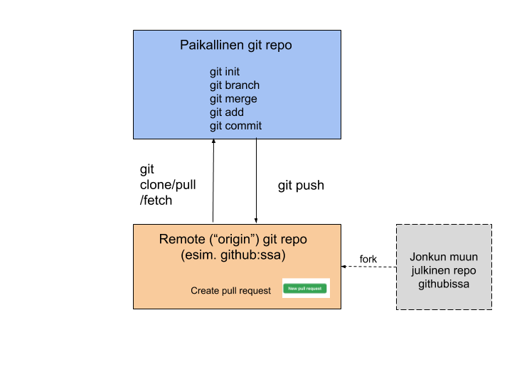
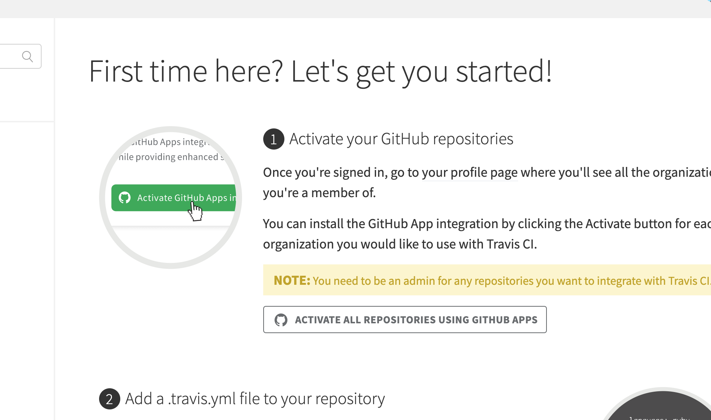
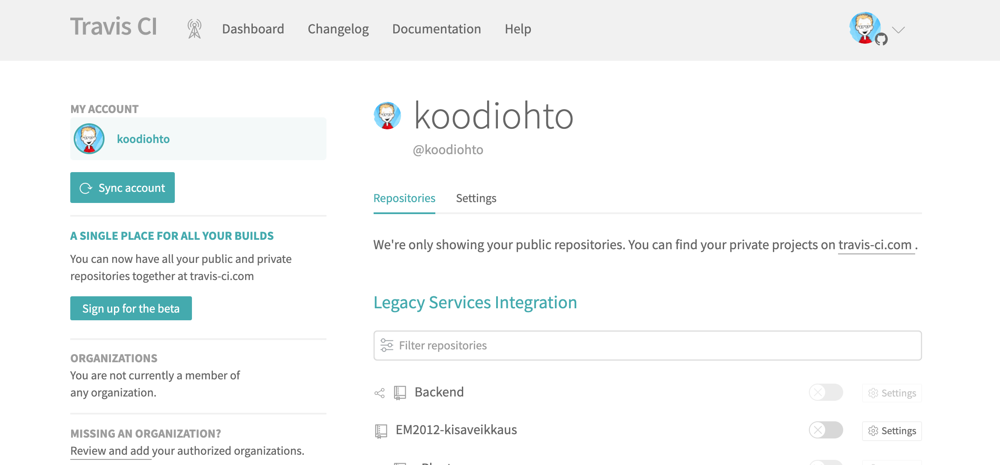

## Sisällysluettelo
* [Kontittaminen (docker)](#Kontittaminen-\(docker\))

# Ohjelmistokehittäjän infra ja automaatiotyökalut

Ohjelmistokehittäjän työssä on paljon oheistyökaluja ja tekniikoita, jotka helpottavat kehitystyötä ja parantavat kehitystyön laatua. Tässä osiossa on esitelty näitä asioita.

## Linuxin ja komentorivin perusteet

Linux ja muut Unix-pohjaiset käyttöjärjestelmät, kuten MacOS, ovat kehittäjien keskuudessa paljon käytettyjä. [Stackoverflown 2020 kehittäjillä tekemän vuosittaisen tutkimuksen](https://insights.stackoverflow.com/survey/2020) mukaan Linuxia [on edellisen vuoden aikana käyttänyt 55% kehittäjistä](https://insights.stackoverflow.com/survey/2020#technology-platforms). Unix-pohjaiset käyttöjärjestelmät tarjoavat toisaalta paljon työkaluja, jotka helpottavat kehittäjän työtä (kuten automaattiset paketinhallintatyökalut kuten apt) ja niillä on helppo myös työskennellä komentorivin kautta vahvoilla komennoilla, joilla pystyy esimerkiksi käsittelemään ohjelmistojen lokitiedostoja, ajastamaan komentoja jne.

### Unix-pohjaisten järjestelmien komentorivi

Unix-pohjaisten järjestelmien komentorivi on kehittäjille monipuolinen ja voimakas työkalu. Komentorivi mahdollistaa paitsi erilaisten työkalujen nopean asentamisen, tiedostojärjestelmän helpon selaamisen, erilaisten testiympäristöjen pystyttämisen jne. Käydään tässä läpi esimerkkien kautta Linux-järjestelmän kehittäjälle hyödyllisiä perusasioita ja komentoja, suurin osa asioista toimii myös muissa Unix-pohjaisissa järjestelmissä.

Alkuun mainittakoon yleisesti, että Linux-komentojen keskeyttäminen tarvittaessa tapahtuu CTRL^C:llä (tai vielä voimakkaampi yhdistelmä on CTRL^Z, joka ei anna processille mahdollisuutta yrittää sulavaa siistiä lopettamista).

#### Unix-komentoja

Print working directory, tulostaa kansion jossa olet.
```shell
$ pwd
/Users/myusername/Documents/
```
Change directoy komennolla liikutaan kansioissa. Tabulatoria käyttämällä voi automaattitäydentää syötteitään, eli jos aloittaa kirjoittamaan jotain ja painaa tabulaattoria, niin järjestelmä täydentää siihen mahdollisen ainoan vaihtoehdon tai sitten tulostaa syötteen alun perusteella mahdolliset vaihtoehdot. 
```shell
$ cd kansionnimi #siirtyy kansioon kyseisen kansion alla
$ cd /Users/kansionnimi #siirtyy absoluuttiseen kansioon tiedostorakenteen juuressa
$ cd .. #Siirtyy hiearkiassa edelliseen kansioon
$ cd ../kansionnimi #Siirtyy hierarkiassa edelliseen alikansioon ja sen alla olevaan kansioon
$ cd #siirtyy käyttäjän kotikansioon
$ cd -#siirtyy kansioon, jossa olit ennen tätä
```
Listaa kyseisen kansion tiedostot ja kansiot
```shell
$ ls
```
-l-vivulla ls-komento tulostaa myös mm. tiedostojen luontipäivämäärän ja koon
```shell
$ ls -l 
```
Linuxin komentoja voi putkittaa (merkillä |). Putkitus more-komennon kanssa tulostaa kansiorakenteen sivu kerrallaan, josta voi edetä enterillä tiedosto kerrallaan (pagedown/up tai u ja d toimii mahdollisesti hieman unix-järjestelmästä riippuen myös), CTRL^C (tai q) lopettaa.
```shell
$ ls -l | more
```
Linuxissa komennon syötteen voi ajaa myös tiedostoon >-merkillä. 
```shell
$ ls -l > tiedosto.txt
#Kahdella >>-merkillä syöte lisätään tiedoston loppuun, kuten 
#tässä käyttäjän kotihakemistossa olevan bashrc-tiedoston loppuun.
$ echo "export EDITOR=\"/polku/jossa/ohjelma/sijaitsee/ohjelma\"" >> ~/.bashrc
```
Manual komennolla (man) saa esiin tietyn kommennon ohjeen ja näkee mm. mitä lisävipuja komennolle voi antaa.
```shell
$ man ls
```
Tiedoston sisällön voi tulostaa cat-komennolla
```shell
$ cat tiedosto.txt
```
Tiedoston voi luoda tai kaksi tiedostoa yhdistää kolmanteen tiedostoon myös catilla
```shell
$ cat >luouusitiedosto.txt
$ cat tiedosto1.txt tiedosto2.txt >yhdistetty.txt
```
Tiedostoja voi kopioida cp-komennolla. Käyttämällä -R (recursive) -vipua voi kopioida kokonaisia kansiorakenteita
```shell
$ cp tiedosto.txt ../ #kopioi tiedoston hierarkiassa edelliseen kansioon
$ cp -R hakemisto /Users/me/toinenhakemisto #kopioi hakemiston toiseen hakemistoon
```
Tiedostoja voi siirtää tai uudelleennimetä mv-komennolla. 
```shell
$ mv tiedosto.txt tiedostonuusinimi.txt
$ mv tiedosto.txt ../ #siirtää tiedoston hierarkiassa edelliseen kansioon
```
Kansioita voi luoda mkdir-komennolla 
```shell
$ mkdir hienokansio
```
Tiedostoja voi poistaa rm-komennolla -R-vivulla voi poistaa kokonaisia kansiorakenteita. 
```shell
$ rm tiedosto
$ rm -R kansiorakenne
$ yes | rm -R kansiorakenne #jotkin unix-järjestelmät kysyvät joka tiedoston kohalla yes-varmistetta, sen voi automatisoida putkittamalla yes-komennon
```
Tyhjän tiedoston voi luoda touch komennolla
```shell
$ touch tiedosto.txt
```
Tiedostoja voi muokata Unix-järjestelmien lukuisilla eri tekstieditoreilla, kuten hyvin perinteinen vi:llä (komennot pitää muistaa aikalailla ulkoa), nano:lla tai monesta järjestelmästä löytyvällä emacs:lla. Editoreilla on omat shortcut-komennot eri asioille kuten tiedoston muutosten tallentamiselle ja editorin sulkemiselle. 
```shell
$ vi tiedosto.txt
$ nano tiedosto.txt
$ emacs tiedosto.txt
```
Tiedostoja voi etsiä tiedostonimen perusteella find-komennolla. *-merkkiä voi käyttää tarkoittamaan, että mitkä tahansa merkit tähden ja seuraavan merkin välillä kelpaa hakuun.
```shell
$ find -name tiedo*.txt
```
Tiedostojen sisällä olevaan tekstiä voi etsiä (ja tekstin sisältävän rivin tulostaa) grep-komennolla. -R etsii rekursiivisesti koko kansiorakenteesta. Grepille annettava etsintäavain tulkitaan [Regular expression -formaatissa](https://en.wikipedia.org/wiki/Regular_expression), eli sitä voi käyttää hyvin monipuoliseen etsintään. 
```shell
$ grep "kissa" tiedosto.txt #sisältääkö sanan kissa
$ grep -R "kissa" * #etsi tämän kansion kaikista alikansioista ja tiedostoista sanaa kissa
$ grep -E "koira|kissa" tiedosto.txt # Sovella regex-patternia, eli etsi sekä koiraa, että kissaa.
```
Tiedoston lopun voi tulostaa tail-komennolla. Tämä komento on erityisen hyödyllinen logitiedostojen seuraamiseen -F-vivulla, jolloin se jää seuraamaan tiedostojen päivittymistä ja jatkaa muutosten tulostamista ruudulla. Tailin voi myös putkittaa grep:in kanssa ja seurata tiedostossa esimerkiksi vain tietyn patternin mukaisia muutoksia. Komennosta voi poistua CTRL^C:llä
```shell
$ tail -F server.log
$ tail -F server.log | grep "ERROR"
```
Kahden tiedoston eroavaisuudet voi listata diff komennolla.
```shell
$ diff tiedosto1.txt tiedosto2.txt
```
chmod-komennolla voi muokata tiedoston tai kansion oikeuksia, eli kenellä on oikeus tehdä tiedostoon minkälaisia muutoksia. Komennolla voi antaa tietylle tiedostolle oikeuksia kolmella eri tasolla. Eli miten tiedostoa saa käyttää sen luonut käyttäjä, miten käyttäjän kanssa samaan ryhmään kuuluvat käyttäjät ja miten muut. Eli tiedostolle voi antaa omalle käyttäjälleen luku-, suoritus- ja muokkausoikeudet, saman käyttäjäryhmän ihmisille luku- ja suoritusoikeudet ja muille ei mitään oikeuksia (edes tiedoston lukemiseen). Tästä monimutkaisesta komennosta voi lukea lisää vaikka [täältä](https://www.computerhope.com/unix/uchmod.htm).
```shell
$ chmod 750 mysqlscript.sh
$ chmod u+x mysqlscript.sh #annetaan käyttäjälle (u) suoritus (x=exceute) oikeudet

```
chown-komennolla voi siirtää tiedoston omistajuuden tietylle käyttäjälle.
```shell
$ chown mysqlUser mysqlscript.sh
```
Sudo ("Switch User and Do this command") -komennolla vältetään nykyään käyttäjien tarvetta vaihtaa käyttäjätiliä root-käyttäjäksi suorittaaksen jonkin enemmän käyttöoikeuksia vaativan asian kuten vaikka uuden ohjelman asentamisen. Jos käyttäjälle on myönnetty sudo-oikeudet käyttöjärjestelmään, niin hän voi siis vaihtaa itsensä hetkellisesti superkäyttäjäksi ja ajaa jonkin enemmän oikeuksia vaativan komennon.
```shell
#&-merkillä laitetaan komento ajautumaan järjestelmässä taustalla, jolloin 
#terminaalin käyttämistä voi jatkaa muihin asioihin.
$ sudo apt install mysql &
```
Unix-järjestelmissä voi määritellä ympäristömuuttujia kuten PATH-muuttujan. Käyttöjärjestelmä etsii komentoja PATH-muuttujaan lisätyistä hakemistoista. Path-muuttujan nykyisen sisällön voi tulostaa echo-komennon avulla.
```shell
$ echo $PATH
```
export-komennolla voit lisätä PATH-muuttujaan uusia hakemistoja. Alla oleva komento siis sanoo, että uusi PATH-ympäristömuuttuja on nykyinen PATH-ympäristömuuttujan arvo ja lisäksi siihen lisätään /usr/me/uusihakemisto-polku.
```shell
$ export PATH=$PATH:/usr/me/uusihakemisto
```
Processes (ps) komennolla voi listata esimerkiksi kaikki kyseisen käyttäjän käynnissä olevat prosessit. Niihin liittyen voi tulostaa ps-komennolla monipuolisesti tietoja eri prosesseista, kuten niiden muistin ja prosessorin käyttömäärän. Näiden perusteella voi tehdä johtopäätöksiä, jos joki prosessi (esimerkiksi serveri) on jäänyt jumiin tai esimerkiksi jokin ohjelma ikuiseen silmukkaan. 
```shell
$ ps ux
```
ps-komennon ajamisen jälkeen (jossa näkyy prosessi id, eli PID) voi joskus olla tarpeen tappaa jokin prosessi sen prosessi id:n (PID) perusteella. Tähän käytetään kill-komentoa, jonka käytössä kannattaa olla jossain määrin varovainen, sillä voi myös sammuttaa koko käyttöjärjestelmän.
```shell
$ kill 1234 #annetaan prosessille mahdollisuus vielä ajaa jotain komentoja
$ kill -9 1234 #Jos prosessi ei vielä edellisellä kuollut, niin tällä lähtee.
```
Käyttäjiä voi lisätä Linux-järjestelmissä useradd-komennolla ja salasana lisätään passwd-komennolla
```shell
$ sudo useradd username
$ sudo passwd username
```
Unix-järjestelmissä on yleensä myös monia tietoliikenteeseen liittyviä käteviä komentoja.
```shell
$ ping 123.343.434 #miten nopeasti osoite vastaa, voi testata vaikka omaa tuotantopalvelinta
$ whois haaga-helia.fi #tietoja tunnuksesta
$ ssh host.jotain.fi  #avataan ssh-etäyhteys etäpalvelimeen
$ wget https://osoite.fi/kuva.jpeg  #Ladataan tiedosto internetistä
```
Ohjelmistokehittäjä pystyy ajamaan unix-järjestelmissä lukuisia kehitystyöhön liittyviä ohjelmia. Tässä vielä niistä muutamia esimerkkejä.
```shell
$ node
$ python
$ java
$ mysql
$ mongo
```

#### Unix-skriptit ja chron

Unix-pohjaisissa käyttöjärjestelmissä on mahdollista luoda skriptitiedostoja, joiden avulla voi esimerkiksi yhdistää monta komentoa yhdeksi komennoksi. Myös esimerkiksi yksinkertaisen haarautumislogiikan (if-else) ja silmukoiden toteuttaminen on mahdollista. Tarkemmin skriptien-kirjoittamisesta voi lukea esimerkiksi [tästä perusoppaasta](https://docs.csc.fi/support/tutorials/env-guide/linux-bash-scripts/).
```shell
$ nano skripti.sh #luodaan skriptitiedosto
```
```bash
#!/bin/bash #skriptit avataan yleensä tällä kommentilla joka kertoo käytettävän komentorivitulkin 
echo "Hello World" #tulostetaan huvikseen teksti echo-komennolla
ls -l | grep $1 > tamakansio.txt #ajetaan kyseisen kansion sisällöstä tiedostoon sellaiset rivit, jotka sisätävät käyttäjän skriptille antaman ensimmäisen parametrin sanan.
```
```shell
$ chmod u+x skripti.sh #annetaan käyttäjälle suoritusoikeudet skriptiin, muuten sitä ei voi ajaa.
$ ./skripti.sh hello #ajetaan skripti ja annetaan sille parametrina sana "hello"
```

Unix-pohjaisissa järjestelmissä on komentojen ajastuksen mahdollistava [cron-prosessi](https://opensource.com/article/17/11/how-use-cron-linux). crontab-komennolla voi määritellä ajastettavia komentojan "ajastustauluun" (cron table). crontab-komento luo käyttäjälle ajastustaulutiedoston /var/spool/cron-kansioon. Crontaulun ajastussyntaksi seuraa tiettyä kaavaa. *-merkki tarkoittaa, että kyseinen ajanmääre voi olla mitä vain.
```shell
1 2 3 4 5 /polku/komento argumentit_komennolle
```
jossa:
* 1: Minuutit (0-59)
* 2: Tunnit (0-23)
* 3: Päivä (0-31)
* 4: Kuukausi (0-12 [12 == Joulukuu])
* 5: Viikonpäivä (0-7 [7 tai 0 == sunnuntai])

```shell
crontab -e #Komento avaa oletustekstieditorin, johon voi syöttää haluamansa ajastuksen
5 0 * * * /Users/me/skripti.sh hello #Aja skripti.sh viisi minuuttia keskiyön jälkeen joka päivä
```

## Versionhallinta (Git) ja Github-palvelu

Varsinkin kun ohjelmistoja kehitetään tiimeissä, on tärkeää hallita ohjelmiston versiohistoriaa ja mahdollistaa kehittäjille osallistuminen kaikkien komponenttien kehittämiseen silloinkin, kun joku muu saattaa kehittää kyseistä komponenttia myös. Versionhallintasovellukset toimivat arkkitehtuuriosiossa esitellyn "Event sourcing"-periaatteen mukaan, eli versionhallintaan lisätään ("commitoidaan") aina uusi muutos, mutta siellä olevia asioita ei suoraan muokata. Näin ollen versionhallinnassa voidaan aina palata minä tahansa ajanhetkenä sovelluksessa vallinneeseen tilaan.

[Git-sovellus](https://git-scm.com/) on noussut nykyisin ylivoimaisesti suosituimmaksi versionhallintasovellukseksi. Git:iä käytetään monesti yhdessä [Github-palvelun](https://github.com/) kanssa, joka mahdollistaa Git-versionhallintarepositoryjen tallentamisen julkiseen verkkoon ja tarjoaa lisäksi muita käteviä toimintoja, kuten [pull-requestit](https://yangsu.github.io/pull-request-tutorial/#:~:text=What%20is%20a%20Pull%20Request,follow%2Dup%20commits%20if%20necessary.).

Erona ennen suositumpiin versionhallintajärjestelmiin (SVN ja CVS), git on [hajautettu versionhallintajärjestelmä](https://fi.wikipedia.org/wiki/Hajautettu_versionhallintaj%C3%A4rjestelm%C3%A4). Tämä siis tarkoittaa sitä, että jokaisella käyttäjällä on oma paikallinen "kopio", eli repository sovelluksen versionhallinnasta. Tässä omassa repositoryssä käyttäjällä on täydet oikeudet tehdä muutoksia ja hallita omaa versiohistoriaansa. Paikallisen repositoryn lisäksi yleensä käytössä on myös ns. upstream-repository (hostattuna esimerkiksi juuri githubissa), johon käyttäjä voi yrittää tarjota omia paikallisia muutoksiaan tai hakea sieltä muiden tekemiä muutoksia. Gitin ydinajatukseen kuuluu versionhallinnan kolme "tasoa": 
1. lokaalien muutosten taso
1. stagingtaso (git add) 
1. varsinainen versionhallinta (git commit)
1. (lisäksi vielä mahdollinen upstream-repon taso) (git push).

Esimerkiksi siis muutosten peruuttaminen (undo) tapahtuu eri tavalla riippuen missä tasolla muutokset ovat.



[Git-sovelluksen omassa dokumentaatiossa](https://git-scm.com/) kehutaan sen olevan helppokäyttöinen. Rehellisyyden nimissä on kuitenkin sanottava, että varsinkin kun Gittiä käytetään yhdessä remote-repositoryjen kanssa, niin koko paletti on vähintäänkin vaikea, jos ei suorastaan monimutkainen. Gitissä on lukemattomia komentoja ja saman asian voi monesti tehdä usealla eri komennolla. Gitin monipuoliseen ja tehokkaaseen käyttöön liittyy paljon käsitteitä periaatteita, joiden ymmärtämiseen menee aikaa. Gitin peruskäyttö on kuitenkin melko suoraviivaista.

Esimerkiksi Atlassian-ohjelmistoyhtiö on tehnyt gitin käytöstä [melko hyvän tutoriaalin](https://www.atlassian.com/git/tutorials/setting-up-a-repository) johon voi tutustua. Käydään tässä myös läpi Gitin peruskäytössä ohjelmoijalle oleellisimpia ydintoimintoja.

```shell
# Luodaan paikallinen git-repository kansiosta, jossa nyt olemme
$ git init 

# Lisätään tiedosto staging tasolle lokaalisti
$ git add README.md

# Lisätään .-asteriksilla kaikki muuttuneet tiedostot tämän kansion alta staging tasolle.
$ git add .

#Lisätään kaikki staging tason muutokset lokaaliin versionhallintaan.
$ git commit -m "initial commit"

# Liitetään paikalliselle repositorylle upstream repo githubissa (tyhjä upstream-repo on luotu ensin githubissa)
git remote add origin https://github.com/YOUR-USERNAME/YOUR-REPOSITORY.git

# Lisätään kaikki paikalliset versionhallinan muutokset remote-repositoryn (eli origin) master-haaraan (branch)
$ git push origin master
$ git push # oletuksena tämänhetkinen paikallinen haara pusketaan originin samaan haaraan, 
# eli ei välttämättä tarvitse erikseen mainita origin master.

# Ladataan jokin repository githubista omalle koneelle, jos ei siis itse perusteta uutta projektia git init:llä.
$ git clone https://github.com/user/repo.git

# Päivitään kaikki upstream-repon muiden tekemät muutokset itselle nykyisessä haarassa (esim. master).
# Git pyrkii tekemään ns. fast-forward automergen, 
# mutta mikäli se ei onnistu tässä, niin git tekee omien ja muiden muutosten 
# yhdistämisestä uuden commit:in versionhallintaan 
# (ja kenties pyytää tekemään tiedostojen manuaalista yhdistämistä ensin). 
# Merge-commit pitää sitten myös pushata upstream-repoon.
$ git pull
# git pull on sama kuin: 
$ git fetch # haetaan muutokset
$ git merge # tehdään yhdistäminen paikallisiin muutoksiin
# rebase-vivulla käytettynä git pull ottaa remote-repositoryn viimeisimmät muutokset ja 
# lisää lokaalit muutokset niiden "perään" versiohistoriassa. 
# Eli toisin sanoen lokaalit muutokset "rebasetaan" (ja mergataan) uudestaan 
# remote repositoryn masterin viimeisimmästä tilanteesta, 
# eikä siitä tilanteesta jolloin lokaalit muutokset ja remote-repon 
# tiet alunperin erosivat, tällöin ei synny myöskään uutta merge-committia. 
# Rebase:n etuna on versihistorian pysyminen siistinä ja lineaarisena, 
# mutta sen käyttäminen voi alkuun olla vähän outoa. 
# Tästä hieman sekavasta asiasta voi lukea lisää esim täältä: 
# https://www.atlassian.com/git/tutorials/merging-vs-rebasing
$ git pull --rebase


# Luo uusi lokaali haara (branch) ja siirry sinne 
$ git checkout -b uusihaara
# myös tämä komentosarja tekee saman asian
$ git branch uusihaara
$ git checkout uusihaara
#pushaa uusi haara myös remote-repositoryyn
$ git push --set-upstream origin uusihaara
# Kun olet tehnyt muutoksia omassa haarassasi ja haluat yhdistää muutokset esim master-haaraan, niin
$ git checkout master # siirry master haaraan
$ git merge uusihaara # yhdistä muutokset uudesta haarasta masteriin
$ git branch -d uusihaara # poista uusihaara

# Katso mitä lokaaleja muutoksia olet tehnyt
$ git status
# Katsele riveittäin tekemiäsi lokaaleja muutoksia 
$ git diff # voit myös antaa paramterina tarkemman tiedostonimen

# Tuhoa lokaalit muutoksesi
$ git checkout . # checkout-komentoa voi käyttää näinkin..
# Tai
$ git restore muutettu_tiedosto.txt
# Jos olet jo lisännyt muutokset staginigiin git add:llä, 
# niin sitten tuhoamiseen pitää käyttää git reset komentoa.

# Jos haluat hetkeksi laittaa lokaalit muutoksesi syrjään ja palata niihin myöhemmin.
$ git stash # muutoksesi menevät stashiin ja working directorysi on tyhjä
#...tee mitä haluat... ja sitten kun haluat taas ottaa muutoksesi takaisin stashista
$ git stash apply

# Tulosta versiohallinan commit-logi ja eri commitien hash-numerot siististi.
$ git log --oneline

# Älä kokeile tätä kotona! Jos on jostain syystä ihan pakko, niin voit siirtää ensin lokaalin 
# repositorysi tiettyyn committiin ja sitten pakottaa myös 
# upstream-repositoryn HEAD:in osoittamaan siihen. Tämä tuhoaa mahdollisesti versiohistoriaa ja saattaa
# muutenkin sekoittaa asioita entisestään.
git reset --hard 8c4c448 # haluamasi commitin hash-numero
git push --force origin master

```

Isompien projektien versionhallintakäytöntöihin ja branching-strategiaan hyvä ja paljon käytössä oleva malli on [Gitflow](https://nvie.com/posts/a-successful-git-branching-model/). [Lisää aiheesta myös Atlassianin hyvässä dokumentaatiossa](https://www.atlassian.com/git/tutorials/comparing-workflows/gitflow-workflow).

## Paketinhallinta ja buildaaminen

Ohjelmistoilla on tyypillisesti kymmeniä riippuvuuksia erilaisiin 3rd party kirjastoihin. Lisäksi ohjelmiston buildaaminen on monesti monivaiheinen prosessi, jossa esimerkiksi ensin halutaan alustaa testausympäristö (vaikka testitietokanta), ajaa yksikkötestit, pystyttää testiserveri, ajaa integraatiotestit, tappaa testiserveri, deployata buildattu projekti staging-ympäristöön jne. Näitä tarpeita ratkaisemaan on syntynyt lukuisa määrä paketinhallinta- ja buildaus-työkaluja, kuten [npm](https://docs.npmjs.com/about-npm/) Node.js:lle, [Maven](https://maven.apache.org/) ja [gradle](https://gradle.org/) Javalle, [pip](https://pypi.org/project/pip/) pythonille, [grunt](https://gruntjs.com/) Javascriptille, jne.

Käsitellään tässä lyhyesti paketinhallintaa ja buildausprosessin automatisointia npm:ää esimerkkinä käyttäen. Muut yllä mainitut työkalut toimivat melko samankaltaisia periaatteita noudattaen ja tärkeintä onkin ymmärtää mitä niillä voi ja kannattaa tehdä ja sitten tarvittaessa googlettaa, miten se jollain tietyllä työkalulla tehdään.

Npm on ensisijaisesti paketinhallintasovellus (omilla sivuillaan he käyttävät termiä "worlds largest software registry"). Npm:n avulla on siis helppo ladata muiden luomia ohjelmistokirjastoja npm:n "keskusrepositorystä". Myös pakettien julkaiseminen itse on hyvin helppoa. Esimerkiksi siis [express-kirjaston](https://www.npmjs.com/package/express) voi ladata itselleen käyttöön npm:n install-komennon avulla:

```shell
$ npm install express
```

Tätä ennen projektista on pitänyt tehdä npm-projekti ajamalla komento (ja vastaamalla kysymyksiin joita komento esittää):
```shell
$ npm init
```

*npm init* Komento luo projektiin package.json-tiedoston, jonka perusteella npm osaa hallita projektia ja sen kirjastoriippuvuuksia. npm init:in jälkeen package.json näyttää suurin piirtein tältä:

```shell
{
  "name": "npmtesti",
  "version": "1.0.0",
  "description": "npm projekti",
  "main": "index.js",
  "scripts": {
    "test": "mocha test"
  },
  "keywords": [
    "node",
    "npm"
  ],
  "author": "Ohto Rainio",
  "license": "MIT"
}
```

Kirjastoriippuvuuksia asentaessa hyvä käytäntö on määritellä tarkka versionumero kirjastosta (yleensä se on viimeisin stabiili versio). npm:ssä tämä onnistuu kätevästi *--save-exact*-vivulla. Versioiden päivittäminen aiheuttaa monesti yllättäviä ongelmia ja ohjelman rikkoutumisen. Versioiden päivittäminen tehdään siis mieluummin hallitusti ja harkitusti silloin kuin itse valitaan.

```shell
$ npm install express --save-exact
```

Tämä komento lisää expressin viimeisen stabiilin version riippuvuuden package.json-tiedostoon:

```shell
...
"dependencies": {
    "express": "4.17.1"
  }
....
```

npm hallinnoi paketteja tietyn projektin alla *node_modules*-kansiossa, johon se siis tallentaa esimerkiksi express-kirjaston tiedostot yllä olevassa esimerkissä. Lisäksi *-g*-vivulla npm asentaa paketteja käyttäjän kotihakemistoon "globaaliin" node_module-kansioon.

Kirjastoriippuvuuden voi poistaa *uninstall*-komennolla:

```shell
$ npm uninstall express
```

Kirjastoriippuvuudet, jotka olisi mahdollista päivittää uudempaan versioon voi tarkistaa:

```shell
$ npm outdated 
```

Päivittämisen voi tehdä:
```shell
$ npm update express 
```

npm:n avulla voi myös suorittaa erilaisia buildaukseen liittyviä toimenpiteitä. Esimerkiksi testaamiseen liittyen voi asentaa mocha-kirjaston:

```shell
#asennetaan --save-dev-vivulla vain development-riippuvuutena devDependencies-haaran alle, 
#eli itse sovellus ei tarvitse tätä pakettia välttämättä pyöriäkseen.
$ npm install --save-dev mocha
```

Lisätään package.json:iin skriptin nimeltä "test" ja se ajaa komennon "mocha"
```shell
...
  "scripts": {
    "test": "mocha"
  }
...
```
Ajetaan package.json:in test-skripti, joka siis ajaa mocha-testit.
```shell
$ npm test
```

Buildaustoimenpiteitä voi konfiguroida myös tarkemmin package.json:issa. Alla olevassa esimerkissä ajetaan testiä ennen start-skripti, jolla käynnistetään node-serveri ja testin jälkeen se sammutetaan toisella skriptillä.:

```shell
...
  "scripts": {
    "test": "mocha",
    "pretest": "npm start",
    "posttest": "npm stop",
    "prestart":"echo 'starting server'"
    "poststop":"echo 'stopping server'"
    "start": "node server.js",
    "stop": "node server.stop.js"
    "omaskripti": "echo 'hello world'"
  }
...
```

Kaikki mahdolliset npm-skriptit on listattu [täällä](https://docs.npmjs.com/misc/scripts). Omiakin skriptejä voi määritellä, ne pitää ajaa kommenolla
```shell
$ npm run-script omaskripti
```

[Omien pakettien julkaiseminen npm-repositoryyn on myös naurettavan helppoa](https://zellwk.com/blog/publish-to-npm/)! Tarvitset vain [npm-tunnuksen](https://www.npmjs.com/signup) ja sitten:
```shell
$ npm login
$ npm publish
```

## Jatkuva integrointi (CI/CD)

Jatkuva integrointi (Continuous integration) tarkoittaa oleellisesti sitä, että kun uutta koodia ajetaan versionhallintaan, niin sille suoritetaan samantien erilaisia laatutarkistuksia. Tyypillisesti ajetaan siis järjestelmän yksikkö- ja integraatiotestit ja lisäksi voidaan tehdä esimerkiksi staattista koodianalysointia, automaattista testausta eri käyttöjärjestelmäympäristöissä, suorituskykytestausta yms. Jatkuvan integroinnin avulla nähdään nopeasti jos uusi koodimuutos on rikkonut jotain tai ei muuten ole laadultaan hyväksyttävä. Joillain tiimeillä on työtilassaan esimerkiksi jatkuvasti kaikille näkyvä "radiaattori"-ruutu, josta voi tarkistaa viimeisimmän buildauksen tilan.

Jatkuvan integroinnin työkaluja on tarjolla useita. [Jenkins](https://www.jenkins.io/) on kenties suosituin jatkuvan integroinnin mahdollistava automaatiopalvelinympäristö isoissa projekteissa. Jenkinsiin on tarjolla lukuisia plugineita. [Travis CI](https://travis-ci.org/) on kätevä CI-työkalu käytettynä yhdessä Githubin tai Bitbucketin kanssa. Sen voi konfiguroida buildaamaan projektin aina kun githubiin tulee uuttaa koodia ja tarvittaessa deployaamaan uusimman buildin herokuun automaattisesti. Buildin jälkeen Travis voi esimerkiksi postata tiimin slack-kanavalle viestin buildin onnistumisesta.

 

Jatkuvalla toimituksella (Continuous deployement) tarkoitetaan prosessia ja työkaluja, joilla voidaan automatisoida hyväksytyn buildin siirtäminen suoraan tuotantoon asti. Esimerkiksi [Nexus repositoryn hallinta](https://www.sonatype.com/nexus/repository-pro) on työkalu liittyen Continuous deploymenttiin Java-maailmassa. Toimitusputken automatisoiminen toimimaan mahdollisimman saumattomasti ja pienellä viivellä kehittäjän tekemästä koodista loppukäyttäjän hyödyntämäksi ominaisuudeksi on ketterän ja leanin kehitysfilosofian mukaista toimintaa. Tätä toimintasmallia kuvaava termi Devops (development and operations) on saavuttanut suurta suosioita IT-alalla viime vuosina.

## Kontittaminen (docker)

<!--
https://www.docker.com/101-tutorial

https://labs.play-with-docker.com/

docker run -dp 80:80 docker/getting-started:pwd

Sitten klikataan port 80 kuvaa, niin aukeaa uusi tutoriaali ->

-->

[Docker-konttityökalulla](https://www.docker.com/) on mahdollista luoda omia muusta käyttöjärjestelmästä eristettyjä "kontteja", jotka sisältävät kaiken tarpeellisen, jotta kontti voi pyöriä itsenäisesti. Dockerilla rakennettuja kontteja on sitten helppo siirtää pyörimään esimerkiksi omalta kehityskoneelta johonkin muuhun paikaan, kuten esimerkiksi aws:än pilveen. Kontittamisen avulla ei tarvitse konfiguroida asioita uudestaan uudessa ympäristössä, vaan kontti sisältää jo alunperin kaikean tarpeellisen pyöriäkseen itsenäisesti missä paikassa vain, joka osaa pyörittää docker-kontteja. 

Konttien avulla on helppo jaella siis valmiita ohjelmia, joita muut sitten voivat käyttää helposti. Esimerkiksi mikropalveluarkkitehtuureissa sovellusten eri komponenttien jakeleminen konteissa on yleinen tapa.

Dockerin [voi asentaa esimerkiksi Ubuntille](https://docs.docker.com/engine/install/ubuntu/), mutta sen asentaminen virtualbox-ympäristöön saattaa vaatia hieman jumppaamista, joten suosittelemme tällä kurssilla käyttämään testailuun ensisijaisesti [dockerin tarjoamaa lab-ympäristöä](https://labs.play-with-docker.com/). Jos seminaarivaiheessa haluaa keskittyä dockeriin, niin silloin se pitänee asentaa itselleen.

Docker-kontit määritellään *Dockerfile*:issä, joka voi näyttää esimerkiksi seuraavalta yksinkertaiselle node-sovellukselle (kansiossa /app siis sijaitsee rakentamamme node-sovellus):

```docker
FROM node:10-alpine
WORKDIR /app
COPY . .
RUN npm install --production
CMD ["node", "/app/src/index.js"]
```
Uuden kontin voi tämän jälkeen rakentaa komennolla:

```shell
$ docker build -t docker-sovellus .
```

Tässä tapauksessa kontin rakentaminen ottaa pohjaksi Dockerfile:ssä määrittelemämme node:10-alpine-imagen (joka sisältää mm. npm paketinhallinan, noden jne). Sitten se kopioi konttiin /app-kansion sisällön ja ajaa kontissa komennon *npm install*.

Tämän jälkeen kontin voi käynnistää:

```shell
$ docker run -dp 3000:3000 docker-sovellus
```
Komento siis ajaa Dockerfilessä CMD-rivillä määritellyn komennon eli *node /app/src/index.js*. Näin kontissa pyörii node sovellus ja voimme avata selaimessa osoitteen *localhost:3000/* ja näemme kontissa pyörivän node-sovelluksen etusivun!

 

Tällä sovelluksella ei ole vielä minkäänlaista omaa kiinteää tallennuspaikkaa, eli sovelluksen tallentamat asiat häviävät kun kontti sammutetaan. Kontin sammuttaminen tapahtuu:

```shell
#Katso kontin ID
docker ps
#sammuta kontti tietyllä ID:llä
docker stop <ID>
#poista sammutettu kontti
docker rm <ID>
```

Jos kontin tallentamaa dataa haluaa säilyttää, niin kontille voidaan luoda "volume", jota docker hallinnoi ja joka siis käytännössä tallentaa docker-kontin asioita paikalliselle levylle.

```shell
#luo volume
docker volume create todo-db
#käynnistä kontti uudestaan volumen kanssa
docker run -dp 3000:3000 -v todo-db:/etc/todos docker-sovellus
```

Docker kontteja voi julkaista [docker-hubissa](https://hub.docker.com/) samantapaisesti kuin githubiin voi julkaista koodia. Tämä tapahtuu *docker push*-komennolla sen jälkeen kun olet luonut uuden repositoryn docker-hubissa. Tähän prosessiin voi tutusta tarkemmin [dockerin omassa tutoriaalissa](https://labs.play-with-docker.com/). Docker-hubista löytyy valmis docker-image esimerkiksi [MySQL-kannalle](https://hub.docker.com/_/mysql) tai [Node-RED:lle](https://hub.docker.com/r/nodered/node-red), jonka voi siis vain ajaa käyntiin komennolla *docker run*.

```shell
docker run -it -p 1880:1880 --name mynodered nodered/node-red
```

<!--
docker tag docker-sovellus {username}/docker-sovellus
docker push {username}/docker-sovellus
-->

[Docker Composella](https://docs.docker.com/compose/) voi luoda sovelluksia, jotka koostuvat useammasta kontista (esimerkiksi omat kontit tietokannalle ja parille pienelle node-sovellukselle). Jätetään Composen käyttäminen tällä kurssilla seminaariharjoitukseksi halukkaille.

## Github dokumentointi

Hyvä projekti on stabiloitu ja dokumentoitu siten, että myös projektin ulkopuolinen taho pystyy hyödyntämään sitä helposti. Opensource-henkisissä projekteissa projektin dokumentoiminen tehdään tyypillisesti githubiin liitettävän README.md-tiedoston avulla. Tämä on esimerkiksi [hyvä README.md-template](https://github.com/othneildrew/Best-README-Template) dokumentoinnin pohjaksi. Projektin dokumentoinnissa tärkeintä olisi tarjota ainakin projektin yleiskuvaus, käytetyt tekniikat, asennusohjeet sekä lisenssimalli. Jatkokehitysajatukset olisi hyvä listata [github-issueiden](https://guides.github.com/features/issues/) kautta.

Githubiin liitettävää README.md-tiedostoa kirjoitetaan [githubin markdown-syntaksin](https://guides.github.com/features/mastering-markdown/) mukaisesti. Esimerkiksi otsikot merkitään markdowniin #-merkillä ja kuvat liitetään syntaksilla \!\[kuvan kuvausteksti\]\(kansiopolku/kuva.png\).

Projektin laajemman dokumentoinnin voi tehdä pelkkää README.md-tiedostoa joustavammalla, monipuolisemmalla ja hieman helpommin muokattavalla [Github-wikillä](https://guides.github.com/features/wikis/).

## Kehitysympäristöt ja IDE:t

Ohjelmistokehittäjän työ tapahtuu aina jonkilaisessa kehitysympäristössä. Alkeellisin kehitysympäristö voi olla pelkkä notepad-tekstieditori ja komentoriviltä ajettava kääntökomento. Kehitystyötä voi kuitenkin nopeuttaa ja helpottaa huomattavasti rakentamalla kyseisen sovelluksen kehittämiseen soveltuvan kehitysympäristön. 

Kehitysympäristössä yleensä oleellisin työkalu on ympäristöön soveltuva IDE (Integrated Development Environment). IDE:jä on tarjolla erilaisiin ohjelmointiympäristöihin lukuisia. Suosittuja ovat esimerkiksi Java-maailmassa Eclipse ja IntelliJ IDEA, JavaScriptille, Pythonille ja monelle muulle kielelle soveltuva Visual Studio Code, Android-ohjelmoinnissa AndroidStudio, IoS-kehityksessä XCode, jne.

IDE:hin on helppo asentaa liitännäisosia, jotka voivat auttaa esimerkiksi koodin formatoinnissa helposti luettavaksi, koodin virheiden etsimisessä, koodin kääntämisessä, testien ajamisessa, versionhallinnan integroimisessa projektiin, debuggaamisessa, jne. IDE:issä on myös esimerkiksi hyödyllisiä pikakomentoja, joiden opetteleminen voi tehdä kehitystyöstä nopeampaa ja mielyttävämpää.

Tässä kuvankaappaus Visual Studio Coden extensions -näkymästä. Oikealla kuvassa näkyy myös hieman miten kyseinen IDE formatoi Github markdownia siistin näköiseksi.
 

## Virtualisointi

## Palvelimet ja deployaaminen

<!--
Palvelimet ovat esimerkiksi linux-käyttöjärjestelmää pyörittäviä koneita, joissa on myös jokin palvelinohjelmisto joka tarjoaa palvelimen sisältöä ulkoverkkoon. 
Kehittäjän ei itse tarvitse enää tehdä monia asioita, vaan työ on enemmän konfigurointia ja tiettyjen työkalujen tuntemista, Pilvipalvelut Azure, AWS, heroku, Firebase, IBM watson, ...-->

## Tehtävät

### Tehtävä 4.1

Kirjoita scripti (lokittaja.sh), joka tarvittaessa luo ja sitten kirjoittaa tiedostoon *loki.log* tämän hetken kellonajan ja tekstin “heippa”. Käytä googlea selvittääksesi miten parhaiten saat aikaleiman tulostettua scriptiin. Ajasta scripti chronilla pyörimään minuutin välein. Kirjoita toinen scripti (tyhjentaja.sh), joka kopioi *loki.log*-tiedoston sisällön *vanhatlogit.log*-tiedoston loppuun ja sitten poistaa *loki.log*-tiedoston. Ajasta tyhjentaja-scripti pyörimään chronissa joka keskiyö. Palauta luomasi kaksi linux-skriptiä (lokittaja.sh ja tyhjentaja.sh) sekä tiedostossa /var/spool/cron/käyttäjänimesi sijaitseva cron-tiedosto, josta näkyy tekemäsi ajastukset.

### Tehtävä 4.2

Ota testausosiossa kirjoittamasi python-ohjelma (tai tehtävän mallivastaus tarvittaessa) ja siihen liittyvät yksikkötestit. Pushaa tämä sovellus itsellesi githubiin ja liitä siihen TravisCI monitorointi seuraavasti: 

1. [Kirjaudu github-tunnuksillasi travikseen](https://docs.travis-ci.com/user/tutorial/#to-get-started-with-travis-ci-using-github).

1. Seuraa traviksen ohjeita ja aktivoi python-ohjelmasi githubrepository travikselle. Activate repository tehdään travis-ci:n settings-valikosta (oikealta github-avatariasi klikkaamalla).
 
 
 
 

1. Tee projektillesi gitissä uusi "development"-haara ja pushaa se githubiin.

1. [Lisää .travis.yml-tiedosto](https://docs.travis-ci.com/user/languages/python/) oman projektisi development haaraan (projektin juureen) ja pushaa se githubiin. 

1. Paina traviksessa “Trigger a build”:ia tai travis lähtee myös automaattisesti käyntiin jos liittäminen on onnistunut oikein. Development haaran buildia pääset katsomaan traviksessa branches-välilehden kautta, jos master on sinulla defaulttina.
 
 
 

1. Liitää projektiisi ja travikseen koodin testikattavuutta mittaava [Coverage-kirjasto](https://coverage.readthedocs.io/en/coverage-5.2.1/). Coverage kannattaa ensin laittaa pyörimään itsellesi paikallisesti ja sitten lisätä tarvittavat skriptit myös .travis.yml-tiedostoon "script" ja "after_success"-osioihin.

1. Tulosta ja palauta Traviksen tuottama CI-raportti jossa näkyy, että sovellus kääntyy, sille ajetaan ainakin yksi yksikkötesti development-haarassa ja yksikkötestikattavauus rivitasolla on jotain yli 0%, mieluusti lähemmäs 100%. Palauta siis kaksi kuvankaappausta, toisessa näkyy github-tunnuksesi ja kuvankaappaus traviksen buildauksesta development-haarassa ja toisessa saman buildin coverage raportti. Alla esimerkit.
 
 

### Seminaaritehtävä 1 (täydennetään seminaarivaiheessa):

Rakenna CI/CD monitorointi ja tuotantoputki ohjelmistoprojekti 2 -projektillenne.

### Seminaaritehtävä 2 (täydennetään seminaarivaiheessa):

Rakenna dockerin ja docker composen avulla ohjelmistoprojekti 2 -projektistanne konttipohjainen sovellus, joka voidaan deployata AWS:ssään.