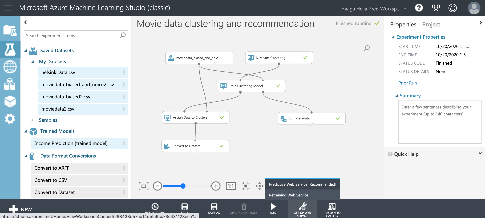
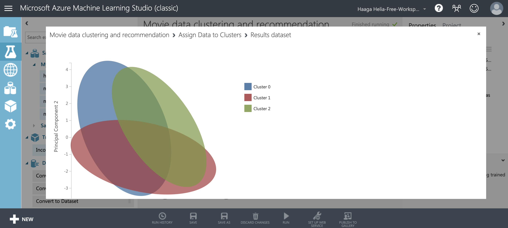

# Azure

> *"The Azure cloud platform is more than 200 products and cloud services designed to help you bring new solutions to life—to solve today’s challenges and create the future. Build, run, and manage applications across multiple clouds, on-premises, and at the edge, with the tools and frameworks of your choice.*"
>
> [Microsoft. What is Azure?](https://azure.microsoft.com/en-us/overview/what-is-azure/)

In this module, we shall demonstrate and practice the use of [Azure](https://azure.microsoft.com/) and a few selected services available there.

This module is done as part of the [IoT Rapid-Proto labs](https://www.rapidprotolabs.eu/) Erasmus+ funded project.


## Goals

Understanding the concepts [PaaS](https://azure.microsoft.com/en-us/overview/what-is-saas/) and [IaaS](https://azure.microsoft.com/en-us/overview/what-is-iaas/). Learning how to deploy a Node.js application in Azure in multiple different ways. Learning how to implement an application as serverless cloud functions. Machine learning, clustering and K-means based classification and recommendations with the help of Azure Machine Learning studio.


## Registering to Azure 

You can log in [Azure Portal](https://portal.azure.com/) using your Haaga-Helia account. You may receive free credits in your account if you register using [student registration](https://azure.microsoft.com/en-us/free/students/). 


## Demo application

During this session we will use the following application to demonstrate the workflows and concepts:

https://github.com/haagahelia/app-deployment-demo

The demo application contains two HTTP endpoints and runs on top of [Express](https://expressjs.com/). You can check the contents of index.js [here](https://github.com/haagahelia/app-deployment-demo/blob/master/index.js).

In short, the server root `/` will return a list of events from [MyHelsinki Open API](http://open-api.myhelsinki.fi/) and the `/health` path will return a JSON object describing the status of the application:

```json
{
  "status": "ok",
  "eventCount": 4667,
  "duration": 1.4089999198913574,
  "port": "80"
}
```

`eventCount` shows how many events from [MyHelsinki Open API](http://open-api.myhelsinki.fi/) were received and `duration` shows the duration of the request to the API.

The data from [MyHelsinki Open API](http://open-api.myhelsinki.fi/) is licensed under [Creative Commons By 4.0 license](http://open-api.myhelsinki.fi/terms).

## Demo 1: Azure as a cloud provider

In Azure, there are typically multiple supported ways of achieving the same goals. Typically documents published by Microsoft will explain how resources are managed and updated using either VS Code extensions or other Azure specific tools, such as the `az` command ([Azure CLI](https://docs.microsoft.com/en-us/cli/azure/)).

This demonstration presents an opinionated view on how to develop and deploy web applications. Generic tools, such as Git, are favored over Azure specific tools. Command line is favored over graphical interfaces, as the GUIs tend to hide some of the details that help us understand how the systems work.

To follow the examples in this document you will need to install Docker. In Ubuntu, Docker can be installed as follows:

```sh
$ sudo apt install docker.io
```

You will also need Node.js and Git that are used also during previous weeks.

<!--
-Millainen ubuntuserveri voidaan pystyttää.
-Jos deployaisi helsingin kaupungin dataa hakevan sovelluksen Azureen? Voitaisiin näyttää mikropalvelun deployaaminen.
-dokkerointi
-pilvifunktiot
-> Tällä saisi näytettyä mitä on PaaS & IaaS.
-->

### IaaS (virtual machines)

> *"Infrastructure as a service (IaaS) is an instant computing infrastructure, provisioned and managed over the internet."*
>
> *"IaaS provides all the infrastructure to support web apps, including storage, web and application servers, and networking resources. Organizations can quickly deploy web apps on IaaS and easily scale infrastructure up and down when demand for the apps is unpredictable."*
>
> [Microsoft. What is IaaS.](https://azure.microsoft.com/en-us/overview/what-is-iaas/)

The following video demonstrates how to create a new virtual machine in Azure and how to deploy your application code there:

**[Video: Azure part 1 - Ubuntu virtual machine](https://web.microsoftstream.com/video/8eb8e43c-3972-4f73-bd75-d5269e45c82e)**

Azure will allow you to either log in with a password, a private key or it can create a new private key for you. If you are using private keys and Linux, you will most likely need to restrict the access to the key file to the owner:

```
$ chmod 600 my_private_key.pem
```

A new SSH connection to the server can be made with the private key, username and server's IP address as follows:

```
$ ssh -i my_private_key.pem username@your.ip.address.here
```

The newly created Ubuntu server contains outdated packages and is missing the Node.js installation. The system is first updated and Node.js is installed with the following commands:

```bash
$ sudo apt update

$ sudo apt upgrade

$ sudo apt install node
```

Note that the Node.js version from the repository may still be outdated for your purposes. In that case, see instructions on how to install Node.js without `apt`. 

After updating the server and installing Node.js, the application can be cloned, installed and started:

```bash
$ git clone https://github.com/haagahelia/app-deployment-demo.git

$ cd app-deployment-demo

$ npm install --production

$ npm start # port 3000

$ sudo PORT=80 node index.js # port 80 requires sudo privileges
```

You can check the results at http://20.54.83.139/health. The server may be shut down after the class.

<!--
Benefits:

* freedom to install and configure everything
* ability to install multiple apps, databases etc.

Weaknesses:

* replication
* scalability
* ...

(source)-->

### PaaS (App Service)

> *"Platform as a service (PaaS) is a complete development and deployment environment in the cloud, with resources that enable you to deliver everything from simple cloud-based apps to sophisticated, cloud-enabled enterprise applications. You purchase the resources you need from a cloud service provider on a pay-as-you-go basis and access them over a secure Internet connection."*
>
> *"PaaS provides a framework that developers can build upon to develop or customize cloud-based applications. ... Cloud features such as scalability, high-availability, and multi-tenant capability are included, reducing the amount of coding that developers must do."*
>
> [Microsoft. What is PaaS.](https://azure.microsoft.com/en-us/overview/what-is-paas/)

The following video demonstrates how to create a new app in Azure and how to deploy your application code there:

**[Video 2: Azure part 2 - App service](https://web.microsoftstream.com/video/615a4f88-4a10-4b39-9ef5-f5f60c4a4c1b)**

Because our demo application is a standard Node.js app built with [Express](https://expressjs.com/), it can be deployed as an App as-is. Azure App Service supports a multitude of different deployment methods, but in our case, we prefer to deploy the application with Git.

As in the video, the deployment can be done by adding the app's Git repository as a remote and deploying the master branch there.

```bash
$ git remote add azure AZURE_REPOSITORY_URL

$ git push azure master
```

After the application is deployed, you can visit it at https://app-deployment-demo.azurewebsites.net/health.

Note that the application is now accessible with a secure HTTPS connection in port 443, although it is internally listening to a different port.

<!--Benefits:

* scalability
* replication

Weaknesses:

* no control over the operating environment-->

### Cloud functions ("serverless")

> *"Azure Functions extends the PaaS concept by providing developers with complete abstraction from the underlying infrastructure through a pay-per-execution billing model that automatically scales based on trigger invocations."*
>
> [Mashkowski, N. Introducing Azure Functions](https://azure.microsoft.com/en-us/blog/introducing-azure-functions/)

> *"Azure Functions is an event driven, compute-on-demand experience that extends the existing Azure application platform with capabilities to implement code triggered by events occurring in Azure or third party service as well as on-premises systems. Azure Functions allows developers to take action by connecting to data sources or messaging solutions thus making it easy to process and react to events. Developers can leverage Azure Functions to build HTTP-based API endpoints accessible by a wide range of applications, mobile and IoT devices. Azure Functions is scale-based and on-demand, so you pay only for the resources you consume.*"
>
> [Mashkowski, N. Introducing Azure Functions](https://azure.microsoft.com/en-us/blog/introducing-azure-functions/)

The following video demonstrates how to create a new function app and deploy it in Azure:

**[Video: Azure part 3 - Cloud functions](https://web.microsoftstream.com/video/04c8b7c5-e431-41de-8175-41c631863a0a)**

During class we extend our demo application with cloud functions. To convert the demo application into an Azure Functions app we will use the `func` command from `azure-functions-core-tools` NPM package:

    # installing the 'func' command
    # see https://www.npmjs.com/package/azure-functions-core-tools
    $ sudo npm i -g azure-functions-core-tools@3 --unsafe-perm true

    # creating a function app
    $ func init   # choose node and javascript

    # adding a new function (http trigger)
    $ func new

    # starting the local development server
    $ func start

The function for filtering and sorting MyHelsinki events is:

```js
const { createEventDateFilter, eventDateComparator } = require('../events/dates');
const { getEventsAsync } = require('../events/client');

module.exports = async function (context, req) {

    let { min_date, max_date } = req.query;
    let dateFilter = createEventDateFilter(min_date, max_date);

    let events = await getEventsAsync();
    let filtered = events.filter(dateFilter);

    filtered.sort(eventDateComparator);

    context.res = {
        body: filtered
    };
}
```

As we are no longer using Express in our application, the dependency was removed from our `package.json` file:

```
$ npm uninstall express
```

We can also remove our start script, as Azure will take care of calling the function when needed:

```diff
 {
   "name": "app-deployment-demo",
   "version": "1.0.0",
   "description": "Demo app used in class",
   "main": "index.js",
   "devDependencies": {
     "mocha": "^8.1.3"
   },
   "scripts": {
-    "start": "node index.js",
     "test": "mocha -u qunit --timeout 10000"
   },
   "author": "Teemu Havulinna",
   "license": "ISC",
   "dependencies": {
-    "express": "4.17.1",
     "node-fetch": "2.6.1"
   },
   "repository": {
     "type": "git",
     "url": "https://github.com/haagahelia/app-deployment-demo.git"
   }
 }
```

Complete source code written during the class can be found at the [cloud functions branch of the demo application repository](https://github.com/haagahelia/app-deployment-demo/tree/cloud-functions).

**Recommended reading:** [Create a function in Azure that responds to HTTP requests](https://docs.microsoft.com/en-us/azure/azure-functions/functions-create-first-azure-function-azure-cli?tabs=bash%2Cbrowser&pivots=programming-language-javascript)

#### Cloud function deployment

The cloud function app can be deployed to Azure using the same deployment center process as demonstrated in our App Service demo:

```sh
$ git remote add azure AZURE_REPOSITORY_URL

$ git push azure master
```

In our case, we may want to use another branch name than `master`. We can use locally a different branch but push it to the remote repository's `master` branch:

```sh
git push remote-name local-branch-name:remote-branch-name
```

When the deployment is complete, the function is available at https://app-deployment-demo-func.azurewebsites.net/api/MyHelsinkiEvents?code=gzGyD55l09pbwbEHAPmmoprcSvOji7YhQDMMZAJWadn5puaCPp498w==&min_date=2020-10-30&max_date=2020-10-31

<!--Azure functions can also be created in VS Code: [Create a function in Azure using Visual Studio Code](https://docs.microsoft.com/en-us/azure/azure-functions/functions-create-first-function-vs-code?pivots=programming-language-javascript).-->

### Docker (containers)

> *"Fundamentally, a container is nothing but a running process, with some added encapsulation features applied to it in order to keep it isolated from the host and from other containers. One of the most important aspects of container isolation is that each container interacts with its own private filesystem; this filesystem is provided by a Docker image. An image includes everything needed to run an application - the code or binary, runtimes, dependencies, and any other filesystem objects required."*
>
> [Docker. Orientation and setup.](https://docs.docker.com/get-started/)

The video ["Docker For Beginners: From Docker Desktop to Deployment"](https://www.youtube.com/watch?v=i7ABlHngi1Q) explains key concepts and workflows for Docker.

For orientation about Docker, see [Orientation and setup](https://docs.docker.com/get-started/) at Docker docs.

Recommended reading: 

* The ["Dockerizing a Node.js web app" tutorial from Node.js](https://nodejs.org/en/docs/guides/nodejs-docker-webapp/) covers creating, building and running a Docker container for a Node.js application.

* Dockerhub contains official [pre-built Node.js images](https://hub.docker.com/_/node) that can be extended by your Dockerfile. In our Dockerfile, we use `12-slim`, which is a very small image running the latest version `12.x` of Node.js.

* You can read more about the different commands in a Dockerfile from the official [Dockerfile reference](https://docs.docker.com/engine/reference/builder/).

#### Dockerignore

To exclude certain folders being copied from our host system into the container we exclude them in a `.dockerignore` file:

```
node_modules
npm-debug.log
```

### Dockerfile

Our Dockerfile follows the example at https://nodejs.org/en/docs/guides/nodejs-docker-webapp/:

```docker
FROM node:12-slim

WORKDIR /usr/src/app

ENV PORT=80

COPY package*.json ./

RUN npm install

COPY . ./

EXPOSE 80

CMD [ "node", "index.js" ]
```

For explanations why `package*.json` files are copied first and the rest of the source code later or why we start the app with `node` and not `npm`, see the ["Docker For Beginners: From Docker Desktop to Deployment"](https://www.youtube.com/watch?v=i7ABlHngi1Q) video.

Another good resource for understanding the Dockerfile is [Anatomy of a dockerfile](https://gist.github.com/adamveld12/4815792fadf119ef41bd).


#### Building the image

Docker images need to be built before running. The builds consist of layers that are cached. Caching makes the builds fast, as when we update our source code, Docker only needs to re-build the topmost layers.

The following command will build the container using the current folder `.` as context and tag the image with the tag `docker-demo`:

```sh
$ docker build -t docker-demo .
```

To deploy our image to Azure, we want to add a specific tag to it, which contains the container registry URL as well our image name (docker-demo) and version (latest):

```sh
$ docker build -t swd4tn023.azurecr.io/docker-demo:latest .
```

We will use this tag later when we deploy the image. This time the build will be instant, as Docker already has all layers cached.


#### Running the image in a local container

The image can be started with `docker run` command and the tag. In our Dockerfile we defined the container to internally listen to port 80. To be able to access that port from our host operating system, we need to [bind a port on our local system](https://docs.docker.com/engine/reference/commandline/run/#publish-or-expose-port--p---expose) to the one inside the container using the `-p` flag.

```sh
$ docker run -p 3000:80 swd4tn023.azurecr.io/docker-demo:latest
```

Now port `3000` on the host system is directed to port `80` inside the container and we can access our app at the URL http://localhost:3000/health.


#### Azure Container Registry

Now that we have our Docker image built and running locally, the next step is to publish it and run it on top of Azure infrastructure. For this we use Azure Container Registry:

> *"Azure Container Registry is a managed, private Docker registry service based on the open-source Docker Registry 2.0. Create and maintain Azure container registries to store and manage your private Docker container images and related artifacts.*"
>
> [Microsoft. Introduction to private Docker container registries in Azure.](https://docs.microsoft.com/en-us/azure/container-registry/container-registry-intro)

There are other container registries as well, such as [Docker Hub](https://hub.docker.com/) and [GitHub Packages](https://github.com/features/packages).

First, we [create a new private container registry in Azure](https://docs.microsoft.com/en-us/azure/container-registry/container-registry-get-started-portal). In our demo, the registry is called `swd4tn023` and located at `swd4tn023.azurecr.io`.

Before pushing our container in the registry, we first need to log in:

```sh
$ docker login swd4tn023.azurecr.io
```

Username for the container registry is the same as the registry name (swd4tn023) and the password can be found in the Azure Portal under *settings* and *access keys*.

When authentication is complete, we use `docker push` command with our **tag**:

```sh
$ docker push swd4tn023.azurecr.io/docker-demo:latest
```

The `push` command will initialize a new *repository* called **docker-demo**. Notice that the tag `swd4tn023.azurecr.io/docker-demo:latest` contains the URL of the registry as well as the repository name and version.

At this point the container image is published in our private container repository, but it's not actually running.


#### Using the container in a Web Application

When the container is published we can create a new webapp in App Service. One possible way for achieving this is explained in ["Migrate custom software to Azure App Service using a custom container"](https://docs.microsoft.com/en-us/azure/app-service/tutorial-custom-container?pivots=container-linux#configure-app-service-to-deploy-the-image-from-the-registry) at Microsoft Docs. Unlike in the previous App Service example, this time we choose to deploy a container, not code. In our example, we are using `app-deployment-demo-docker` as the name of our application.

By using the Azure portal, we can also configure our app to trigger a new deployment when the Docker image is updated in the registry. The "Contiunuous deployment" option can be found in "Container settings" of the app. After the container app is running, we can visit it at:

https://app-deployment-demo-docker.azurewebsites.net/health

Note that the application is now accessible with a secure HTTPS connection in port 443, although our container is internally listening to port 80.


#### Continuous integration for the container

Finally, we can automate our workflow by using a continuous integration system, such as GitHub actions or Travis.

In our example, we use [Publish Docker Container](https://github.com/actions/starter-workflows/blob/b4fa2522d2fe556c03cc194dcf659b1eb9f03b77/ci/docker-publish.yml) action at GitHub and customize it to use Azure Container Registry instead of [GitHub Packages](https://github.com/features/packages).

The results of the action can be [observed at GitHub](https://github.com/haagahelia/app-deployment-demo/actions?query=workflow%3ADocker).

The Container Registry password must not be included in the automation file in plain text. Instead, it is defined as a [GitHub secret](https://docs.github.com/en/free-pro-team@latest/actions/reference/encrypted-secrets) and injected to the `docker login` command as follows:

    echo "${{ secrets.CR_PAT }}" | docker login swd4tn023.azurecr.io -u swd4tn023 --password-stdin

See the entire `docker-publish.yml` file [here](https://github.com/haagahelia/app-deployment-demo/blob/master/.github/workflows/docker-publish.yml).


## Demo 2: Machine learning, K-means Clustering recommendations.

In this demo we shall build a K-means clustering model for movie recommendations with the help of [Azure machine learning studio](https://studio.azureml.net/). We will deploy the trained model as a web service and ask for a new classifications (that could be used for providing new recommendations).

Here are listed some useful links related to this demo:
1. [Machine learning in general from Azure documentation](https://azure.microsoft.com/en-us/services/machine-learning/)
1. [Clustering modules in Azure general introduction](https://docs.microsoft.com/en-us/azure/machine-learning/studio-module-reference/machine-learning-initialize-model-clustering)
1. [K-Means clustering](https://docs.microsoft.com/en-us/azure/machine-learning/studio-module-reference/k-means-clustering)
1. [Azure's comprehensive documentation related to artificial intelligence and e.g. Azure reference architectures for different machine learning scenarios](https://docs.microsoft.com/en-us/azure/architecture/data-guide/big-data/ai-overview)
1. [An example of building a K-means clustering for S&P 500 companies based on their wikipedia data](https://gallery.azure.ai/Experiment/60cf8e46935c4fafbf86f669121a24f0)




<!--
1. Tehdään moviedata esimerkki ja siten että vaihdetaan datasetti painotettuun datasettiin livenä ja sitten painotettuun jossa on myös kohinaa. Voidaan ehkä vaihtaa myös clustereiden määrää johonkin muuhun kuin ilmiselvään kolmeen ja katsoa miltä clusterointi näyttää.
1. Visualisointi voidaan otaa suoraan Train Clustering modelilta oikealla klikillä, Visualisointi pyrkii laittamaan 2d tasoon eri luokat suhteessa toisiinsa kuten kuvattu täällä https://docs.microsoft.com/en-us/azure/machine-learning/studio-module-reference/k-means-clustering.
1. Jokaisen pisteen assignementti voidaan katsoa edit metadatan tai convert to datasetin visualize -menuitemin kautta.
1. Set up web service
1. Deploy web service
1. Käytetään ensin TEST:in kautta web serviceä.
1. Sitten voidaan klikata request/response api help -page linkkiä ja katsoa pythonkoodi jolla kutsua apia (api key pitää vaihtaa)
1. Näytetään ? kuvakkeen kautta "tour", jossa luodaan malli tulojen ennustamiseen.
-->

<!--
Helsinki datan esimerkki jos sitä hieman näytetään:
1. Create machine learning studio classic workspace.
1. Create experimentin kautta lähdetään luomaan mallia.
1. Valitaan helsinkiData.csv dataksi
1. (Laiteaan feature hashing mukaan.) -> ei vaikuta tässä
1. Valitaan k-means clustering (kokeillaan säätää sen parametreja, centroids 3 esim ja sitten kohti 8:aa)
1. Valitaan Select columns in Dataset ()
1. Valitaan Train clustering model, johon syötetään sekä k-means clustering että select columns.
1. Valitaan edit metadata, johon syötetään Train clusteringin oikeasta liittymästä tulokset
1. Valitaan edit metadatasta (oikea klikki) -> Result dataset -> Visualize
1. Klikataan name-kolumnia ja valitaan että "compare to assignements".
1. Kun k-means klusteringin centroidien määrää kasvattaa (esim. ensin 3 -> 5 ja sitten 5 -> 7), niin rupeaa löytymään erilaisia teattereita (kolme eri teatteriklusteria, 3:lla kaikki menee samaan), tämän voi havainnollistaa klikkaamalla tag2-kolumnia ja siitä compare to assignements.
-->

## Demo 3: Enterprise Azure, Houston Inc.

---

## Assignment 7.1: Cloud IoT

In this exercise we use Docker and the Message Queuing Telemetry Transport protocol (MQTT), which is often used by IoT devices. MQTT enables us to easily publish and subscribe to events instead of exchanging requests and responses directly between a client and a server: 

> *"MQTT is data centric whereas HTTP is document-centric. HTTP is request-response protocol for client-server computing and not always optimized for mobile devices. Main solid benefits of MQTT in these terms are lightweightness (MQTT transfers data as a byte array) and publish/subscribe model, which makes it perfect for resource-constrained devices and help to save battery.*"
>
> [Serozhenko, M. 2017. MQTT vs. HTTP: which one is the best for IoT?](https://medium.com/mqtt-buddy/mqtt-vs-http-which-one-is-the-best-for-iot-c868169b3105)

An added benefit from MQTT is that the applications publishing and receiving messages do not need to have public IP addresses or open ports. A good explanation about the architecture can be found at [mqtt.org](https://mqtt.org/). 

As our data source we use the [Digitransit High-frequency positioning API](https://digitransit.fi/en/developers/apis/4-realtime-api/vehicle-positions/):

> *"Most of the vehicles in the HSL area should publish their status, including their position, once per second. The devices of the end users, e.g. smartphones, may subscribe to receive the relevant messages based on their context, e.g. filtered on the mode of transport, the route ID, the geographical region etc. The subscription scope is specified by the MQTT topic structure of the API."*
>
> [Digitransit, 2020. High-frequency positioning.](https://digitransit.fi/en/developers/apis/4-realtime-api/vehicle-positions/)

Our application is meant to **observe the traffic conditions at a certain road section and report detected anomalies to another MQTT queue**. In the exercise we are only interested in a specific road section so we limit our subscription to events occurring there. As the example location to observe we have selected [Lauttasaari Bridge](https://goo.gl/maps/qEKv3F9pbWECms857). More specifically, our coordinates are **60°09'43.4"N 24°53'50.9"E** (60.162050, 24.897470). 

In MQTT, messages are filtered with topics. Topics are strings that consist of one or multiple levels separated by slashes `/`, such as `/foo/bar/baz`. They may first appear similar to URLs, but clients may use wildcards `+` and `#` to match multiple topics at once. Wildcards can only be used when subscribing to messages, not when publishing them. You can read more about the concepts [here](https://www.hivemq.com/blog/mqtt-essentials-part-1-introducing-mqtt/).

An example topic for ongoing vehicle positioning events for buses at our street section is:

```
/hfp/v2/journey/ongoing/vp/bus/+/+/+/+/+/+/+/+/60;24/18/69/27/#
```

Notice that in the topic, location `60.162050, 24.897470` is converted to `60;24/18/69/27` as instructed in the [Digitransit documentation](https://digitransit.fi/en/developers/apis/4-realtime-api/vehicle-positions/#the-topic) (see section **geohash** for more information). You can test subscribing to events on that topic with the `mqtt` command as in [Digitransit documentation](https://digitransit.fi/en/developers/apis/4-realtime-api/vehicle-positions/):

```sh
$ npm install -g mqtt
$ mqtt subscribe -h mqtt.hsl.fi -p 8883 -l mqtts -v -t "/hfp/v2/journey/ongoing/vp/bus/+/+/+/+/+/+/+/+/60;24/18/69/27/#"
```

We recommend using the `mqtt` command on Linux. The command makes a connection to `mqtt.hs.fi`, subscribes to the given topic and waits for incoming messages. When a bus sends a positioning message inside our coordinates, a one-line JSON string in the following format is printed to the console:

```js
// Creative Commons BY 4.0 International. © Helsinki Region Transport 2020
{
  "VP": {
    "desi": "54",
    "dir": "1",
    "oper": 17,
    "veh": 39,
    "tst": "2020-10-29T09:42:27.172Z",
    "tsi": 1603964547,
    "spd": 22.38,
    "hdg": 245,
    "lat": 60.239832,
    "long": 24.919478,
    "acc": 0.00,
    "dl": -12,
    "odo": 10710,
    "drst": 0,
    "oday": "2020-10-29",
    "jrn": 264,
    "line": 71,
    "start": "11:24",
    "loc": "GPS",
    "stop": null,
    "route": "1054",
    "occu": 0
  }
}
```

All attributes are documented at https://digitransit.fi/en/developers/apis/4-realtime-api/vehicle-positions/#the-payload. In this exercise we are interested in the attribute `spd`, which is speed of the vehicle in meters per second (m/s). Note that the vehicle in the sample data appears to be driving 80.56 km/h (22.38 m/s), which is slightly over the speed limit at Kehä I. If you do not receive any positioning messages for a while, you can use [Bussitutka.fi](https://bussitutka.fi/map#13/60.162050/24.897470) to check when a bus is approaching the Lauttasaari Bridge.

In JavaScript code, similar MQTT subscription and logging can be done as follows:

```js
// Example modified from https://github.com/mqttjs/MQTT.js#example
const mqtt = require('mqtt');

// Vehicle positioning for ongoing buses at Lauttasaari bridge
const myTopic = '/hfp/v2/journey/ongoing/vp/bus/+/+/+/+/+/+/+/+/60;24/18/69/27/#';

const hslClient = mqtt.connect('mqtts://mqtt.hsl.fi:8883');

hslClient.on('connect', function () {
    hslClient.subscribe(myTopic, function (err) {
        if (!err) {
            console.log('Connected!');
        } else {
            console.log(err);
        }
    })
});

hslClient.on('message', function (topic, message) {
    // todo: handle the traffic jam and speeding logic here
    console.log(message.toString());
});
```

The example uses the MQTT.js library, which you can read more about at https://github.com/mqttjs/MQTT.js. Each time our app receives a message, it is handled by the `'message'` event handler and logged with `console.log`. In Digitransit API, the messages are JSON encoded (see above JSON example) and can be decoded into JavaScript objects using `JSON.parse`:

```js
let json = JSON.parse(message.toString());
let speed = json.VP.spd;

console.log('Speed: ' + speed);
```

### Step 1: reporting traffic jams

Create a new NPM package in an empty folder. Then install `mqtt` as a dependency:

```sh
$ npm init
$ npm install mqtt --save
```

Create a new JavaScript file `index.js`, where you connect to the Digitransit API with the topic described earlier. You can use the JavaScript code sample as a template. If you wish, you can also use any other coordinates, but you need to convert them to the Digitransit topic format yourself.

When you receive an incoming message, observe the speed and report potential traffic jams to a new MQTT queue. The current speed limit for Lauttasaari Bridge is expected to be 30 km/h or 8.33 m/s. You can choose the speed threshold for traffic jams freely. **Remember that speeds in the API are in meters per second (m/s).** <!--In the model answer, speeds below 15 km/h (4.17 m/s) are considered traffic jams.-->

For reporting the traffic jams, use a public MQTT server at `test.mosquitto.org`. The test server allows us to publish messages without authentication. You can make another MQTT connection to the Mosquitto broker by calling `mqtt.connect` again:

```js
const mosquittoClient = mqtt.connect('mqtt://test.mosquitto.org:1883');
```

Report the potential traffic jams with a topic `"/swd4tn023/MY_ALIAS/traffic/jam"`, where `MY_ALIAS` is any unique string that differentiates your message from the ones by your classmates. The contents of your messages should mimic the following JavaScript object:

```json
{
    "oper": 17,
    "veh": 39,
    "lat": 60.239832,
    "long": 24.919478,
    "spd": 5.0,
    "cause": "Potential traffic jam"
}
```

Use operator id (*oper*), vehicle id (*veh*), coordinates (*lat*, *lon*) and speed (*spd*) from the incoming message from Digitransit. The new message can then be published using the `publish` method with the topic and the message:

```js
mosquittoClient.publish('/swd4tn023/MY_ALIAS/traffic/jam', JSON.stringify(myMessage));
```

To test your publishing logic, you can open another terminal window and listen to the queue there:

```sh
mqtt subscribe -h test.mosquitto.org -p 1883 -l mqtt -v -t "/swd4tn023/MY_ALIAS/traffic/#"
```

The wildcard `#` at the end will allow you to listen to messages from this and the next step simultaneously.


### Step 2: reporting speeding

If you observe speeds that you suspect to be over the speed limit, send another message containing "Potential speeding" as the cause:

```json
{
  "oper": 17,
  "veh": 39,
  "lat": 60.239832,
  "long": 24.919478,
  "spd": 11.9,
  "cause": "Potential speeding"
}
```

For the speeding messages, use the topic `/swd4tn023/MY_ALIAS/traffic/speeding` on `test.mosquitto.org`. You can choose the speeding threshold freely. If the speed limit is 30 km/h, any speed over 8.33 m/s can be considered speeding.

Note that you are not supposed to open a new connection for each message. Instead, open the connections to `mqtt.hsl.fi` and `test.mosquitto.org` when the application starts and re-use those connections in your code.


### Step 3: building the app as a Docker container image

Finally, build and verify running the application using Docker. You can use the [Dockerfile](https://raw.githubusercontent.com/haagahelia/app-deployment-demo/master/Dockerfile) and [.dockerignore](https://raw.githubusercontent.com/haagahelia/app-deployment-demo/master/.dockerignore) files from the Azure demo as your starting point. You do not need to add any new steps, but you can remove all steps concerning port numbers, including the `-p` flag when running the container.

Save the output of your `docker build` command in a file named `docker.txt`. If you build the image multiple times, the output can be saved from any build.

Remember that you need to re-build the image if you make any changes to your source code. Building should be very fast, as Docker caches the previous steps. You do not need to publish your Docker image in a repository, but you are free to do so as an extra exercise.


### Submitting the exercise

Submit your `index.js` and `Dockerfile` in Teams before our next session. Also include the file `docker.txt`, where you copied the output from your `docker build` command. In case Teams rejects the `index.js` file as unsafe, rename it to `index.js.txt`. Do not submit a zip archive.


<!--### Additional reading

[Introducing the MQTT Protocol - MQTT Essentials: Part 1](https://www.hivemq.com/blog/mqtt-essentials-part-1-introducing-mqtt/)-->

----- 

## Seminar assignment 1
Build a machine learning model with some interesting data related to e.g. your software project assignment with the help of Azure machine learning studio. You can e.g. build a recommendation system with the help of k-means clustering. You can deploy your service as a Web API.


-----

## Digitransit license

The data in these Digitransit High-frequency positioning API is licensed under the [Creative Commons BY 4.0 International](https://creativecommons.org/licenses/by/4.0/) -license. © Helsinki Region Transport 2020. See [terms of usage](https://digitransit.fi/en/developers/apis/6-terms-of-use/).