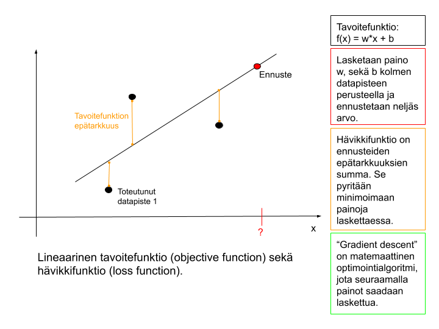
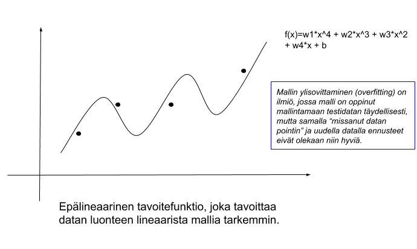
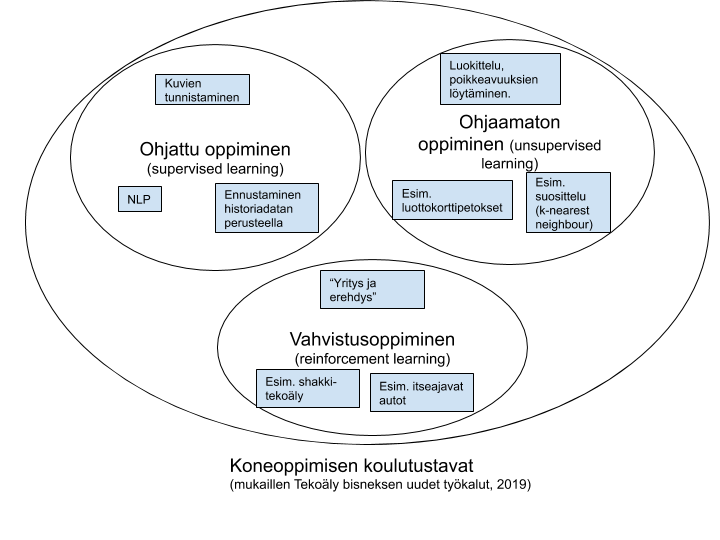
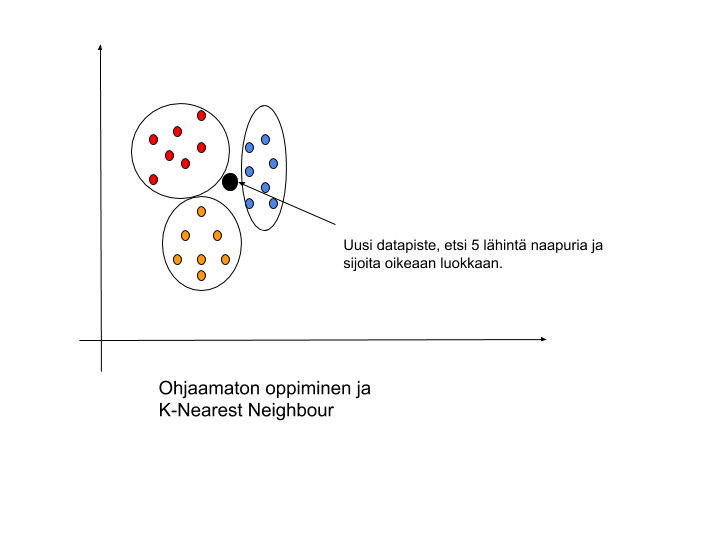
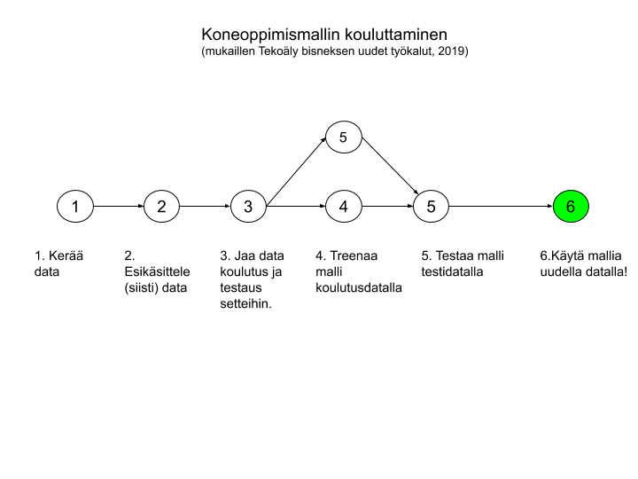
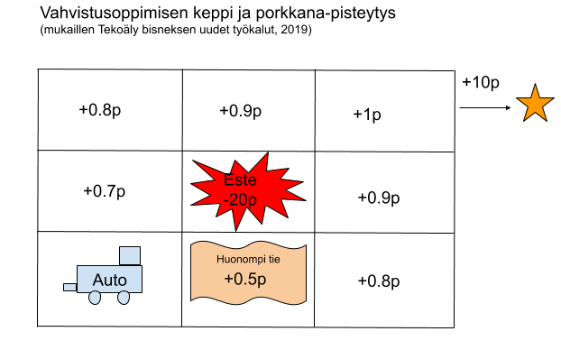
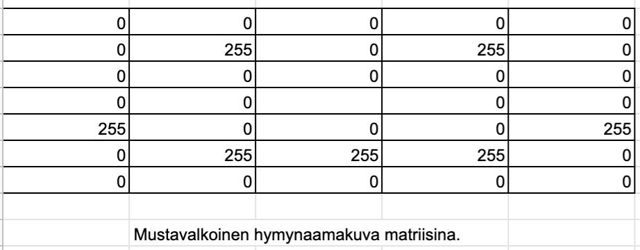
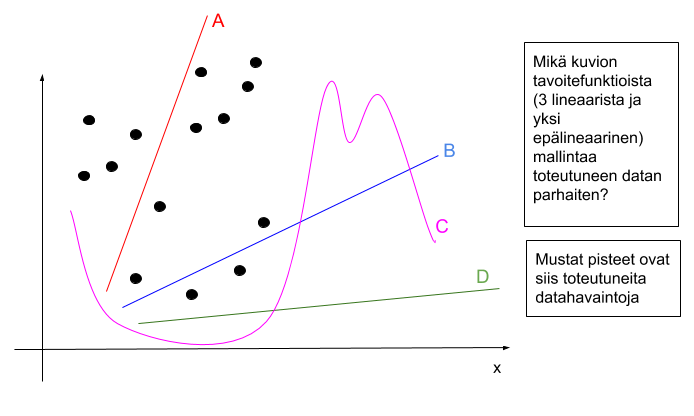
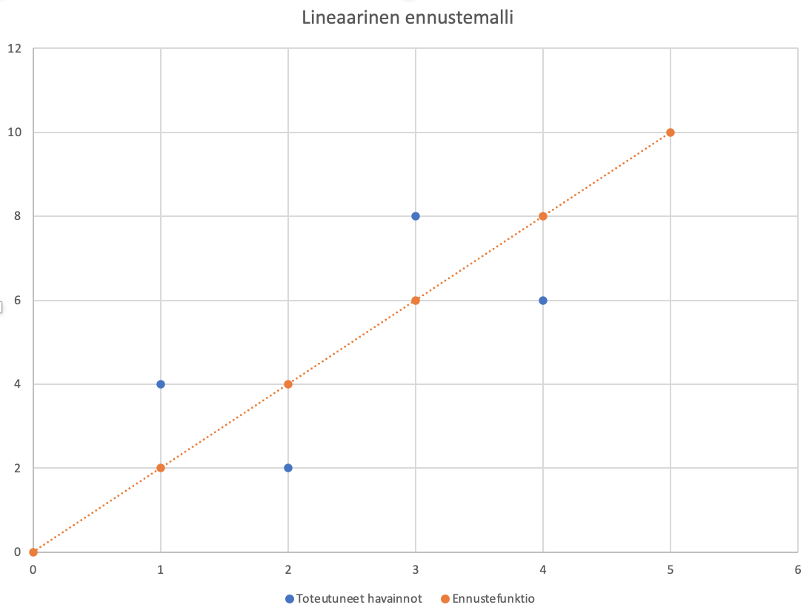

## Sisällysluettelo

* [Johdanto koneoppimiseen](#johdanto-koneoppimiseen)
* [Miten kone oppii](#miten-kone-oppii)
* [Koneoppiminen käytännössä](#koneoppiminen-käytännössä)
* [Tehtävät](#tehtävät)

# Johdanto koneoppimiseen

Koneoppimisessa on kyse siitä, että datan avulla tietokone voidaan opettaa ratkaisemaan ongelmia tietyssä toimintaympäristössä ilman varsinaista ohjelmointia. Dataa kyseisestä ongelmakentästä täytyy kuitenkin olla paljon, jotta *koneoppimismalli* voidaan kouluttaa. Ongelmakentän tulee myös olla tarkasti rajattu, eikä samalla datalla koulutettua mallia voida siirtää toisen ongelman ratkaisuun. Termiä *tekoäly* tunnutaan käyttävän monesti myös synonyyminä koneoppimisesta ja toisaalta mikä tahansa tavallinen ohjelmoitu algoritmi saatetaan nykyään luokitella valtamediassa "tekoälyksi". 

Yksinkertaisia ongelmia voi mallintaa lineaarisilla funktioilla. Kerätyn datan perusteella, voimme laskea lineaariselle *tavoitefunktiolle (objective function)* painokertoimet ja tehdä ennusteen uudelle datapisteelle. Rakennetun mallin hyvyyttä voidaan mitata esimerkiksi [Root Mean Square Error](https://en.wikipedia.org/wiki/Root-mean-square_deviation):lla (eli lasketaan toteutumien ja ennustefunktion antamien arvojen erotusten (keltaiset viivat kuvassa) neliöiden summa, jaetaan se toteutumien määrällä (3 kpl kuvassa) ja otetaan neliöjuuri tästä).

[Tässä esimerkki lineaarisesta mallista Google Sheetissä, jota käydään läpi tunnilla.](https://docs.google.com/spreadsheets/d/1vCNstzPycii9qNs1EA8imoUEZH-EQR7uqQN6fE7XN90/copy)

Usein reaalimaailman asiat ja ilmiöt ovat sen verran monimutkaisia, että lineaarinen ennustemalli olisi hyvin epätarkka. Tällöin voidaan käyttää sen sijaan epälineaarista tavoitefunktiota.

Edelliset ennustemallit ovat vielä ihmiselle helposti ymmärrettäviä. Kuitenkin vielä epälineaarisia ennustemalleja parempi on yleensä neuroverkkoihin pohjautuva ennustemalli. Neuroverkkoa voi ajatella samanlaisena (mutta monimutkaisena) matemaattisena funktiona, jossa on painokertoimet kuten lineaarisessa ja epälineaarisessa tavoitefunktiossa. Neuroverkoissa painokertointen määrittäminen vain on korkeamman asteen matematiikkaa. Tämä matemaattinen mallinnustapa on saanut inspiraationsa ihmisaivojen neuroverkoista, jotka aktivoituvat (painottuvat) niiden käytön mukaan. Neuroverkkojen yhteydessä puhutaan myös syväoppimisesta (deep learning), mikä viittaa neuroverkon kerrosten syvyyteen. Neuroverkkoja voi käyttää varsin sujuvasti ymmärtämättä niiden tarkkaa matemaattista toteutusta. Kuitenkin neuroverkkojen toimintaa (ja mallin hyvyyttä) säädetään ns. *hyperparametrien* avulla, joiden tehokas käyttö edellyttää jonkin verran ymmärrystä neuroverkkojen toiminnasta.
 

## Miten kone oppii

 

Koneen opettamiseen on kolme erilaista tapaa, **ohjattu oppiminen, ohjaamaton oppiminen ja vahvistusoppiminen**. Eri tavat soveltuvat erikaltaisten ongelmien ratkaisemiseen.  

**Ohjatussa oppimisessa (supervised learning)** annamme koneelle ison joukon *merkittyä dataa (labelled data)*. Koneelle voidaan siis antaa esimerkiksi 1000 kuvaa, joissa esiintyy kissa (tai rikkoutunut putki tai syöpäkasvaimen esivaihe). Tai koneelle voidaan antaa lauseita, joiden on luokiteltu sisältävän vaikka 50% "politiikkaa" ja 30% "luonnonsuojelua". Datan merkitseminen pitää tyypillisesti tehdä manuaalisena käsityönä. Kun kone on siis ajanut esimerkiksi 1000 kissakuvaa neuroverkkoon, niin se osaa tämän rakentamansa *mallin* avulla tunnistaa esiintyykö jossain tuntemattomassa kuvassa kissa. Koulutuksen aikana voidaan säätää mallin *hyperparametereja*, jotka vaikuttavat siihen kuinka hyvä mallista tulee. (Tekoäly bisneksen uudet työkalut, 2019).

**Ohjaamattomassa oppimisessa (unsupervised learning)** koneelle annetaan vain joukko dataa ja koneen annetaan itse tunnistaa datasta samankaltaisuuksia ja jakaa data joukkoihin. Mallin *hyperparametreja* säätämällä kone saadaan painottamaan datan luokittelussa erilaisia asioita. Ohjaamattoman oppimisen hyvä puoli on se, ettei dataa tarvitse luokitella itse, mutta toisaalta ohjaamaton oppiminen soveltuu vain rajattuihin ongelmiin, kuten poikkeavuuksien löytämiseen, asiakaryhmien luokitteluun jne. Ohjaamattoman oppimisen eräs mielenkiintoinen sovellutus on *K-Nearest Neighbours-algoritmiin* perustuva suosittelu. Jos esimerkiksi verkkokaupan asiakkaat on luokiteltu erilaisiin ryhmiin, niin uusi asiakas voidaan hänen käyttäytymisensä perusteella luokitella kuuluvaksi tiettyyn ryhmään ja suositella hänelle esimerkiksi samoja tuotteita, joita muut sen ryhmän asiakkaat ovat ostaneet. (Tekoäly bisneksen uudet työkalut, 2019).

 

Ohjattu ja ohjaamaton oppiminen toimivat siis alla olevassa kuvassa esitettyjen vaiheiden mukaisesti. 
 

**Vahvistusoppimisessa (reinforcement learning)** koneen annetaan itse kokeilla ja tehdä virheitä "keppi ja porkkana"-mallilla. Vahvistusoppimista varten rakennetaan simulaatioympäristö, jossa koneelle annetaan pisteitä sen toiminnasta. Vahvistusoppiminen toimii hyvin esimerkiksi erilaisten pelien, vaikkapa shakin, kouluttamisessa. Tietokone voi pelata miljoonia pelejä itseään vastaan ja "simulaatioympäristö" antaa palautetta yksinkertaisimmillaan vain siitä, voittiko kone pelin. Monessa oikean maailman ongelmassa palautesykli koneen tekemien valintojen ja onnistumisen välillä voi olla hyvin pitkä (helposti vaikka useita viikkoja), jolloin kone oppii hyvin hitaasti. Samaten simulaatioympäristön rakentaminen voi olla haastavaa. Käytännön maailmassa itseajavia autoja pyritään kouluttamaan vahvistusoppimisen avulla. Ihminen voi siis esimerkiksi istua auton kyydissä ja antaa jatkuvasti pisteitä koneen tekemistä valinnoista.

### Kuvadatan muokkaaminen

Jotta kone voi oppia esimerkiksi kuvadatasta, pitää kuvadata muokata koneen ymmärtämään matriisimuotoon. Yksinkertainen esimerkki mustavalkoisesta hymynaamakuvasta voisi olla jotain alla olevan kaltaista. Eri harmaan sävyt kuvassa (0-255) on siis esitetty numeroina. Jokainen matriisin solu vastaa yhtä pikseliä kuvassa.

### Tekstiaineiston käsittely

Myös tekstiaineiston käsittely edellyttää sen muokkaamista matriisimuotoon. Lausetasolla siis esimerkiksi lause "Tänään on kuuma päivä" ja "Tänään on kylmä päivä" kuvattaisiin
[1, 2, 3, 4] ja [1, 2, 5, 4]. Numeroiden merkitys olisi siis 1=tänään, 2=on, 3=kuuma, 4=päivä ja 5=kylmä.

[Tässä artikkelissa on avattu hyvin kieliaineiston käsittelyä koneoppimisessa](https://realpython.com/python-keras-text-classification/). Artikkelissa puhutaan myös esimerkiksi sanavektoreista, joiden avulla voidaan esimerkiksi päätellä että: 
>Kuningas - Mies + Nainen = Kuningatar.

Sanavektorit siis asettavat samankaltaiset sanat vektoriavaruudesta lähelle toisiaan ja toisaalta esimerkiksi sanan mies etäisyys kuninkaasta on täsmälleen sama kuin naisen etäisyys kuningattaresta. Jos meillä on kielioppina siis sanat "Nainen, Mies, Kuningatar ja Kuningas", niin esimerkiksi kuningattaren sanavektori voisi näyttää jotenkin tältä:
[1, -0.5, 0.2, -0.2]. Vastaaasti Miehen: [0.5, 1, -0.2, 0.2]. Kuningatar taas: [-0.2, 0.2, 1, 0.5]. 
Esimerkiki myös värit olisivat sanavektoriavaruudessa lähellä toisiaan.

## Koneoppiminen käytännössä

Koneoppimiseen liittyy useita kirjastoja ja työkaluja, joilla kaikilla on oma roolinsa koneoppimismallien rakentamisessa tai havainnollistamisessa. 

*(Yleisesti on todettava, että koneoppimiskirjastojen rajapinnat eivät ole vielä valitettavasti kehittyneet aivan yhtä korkealle abstraktiotasolle (ja helppokäyttöisiksi) kuin esimerkikiksi webohjelmointiin liittyvät kirjastot. Kuten muussakin ohjelmoinnissa, hyvä tapa lähteä liikkeelle koneoppimismallien rakentamisessa on pyrkiä etsimään esimerkki, joka tekee melkein saman asian jota itse yrittää tehdä ja sitten muokata esimerkkiä omiin tarpeisiin sopivaksi. Internetistä löytyy paljon esimerkiksi Googlen Colaboratoryllä tehtyjä esimerkkipohjia erilaisiin koneoppimisskenaarioihin.)*

1. [Python](https://www.python.org/) on ohjelmointikieli, jolla on kirjoitettu lukuisia koneoppimiseen liittyviä kirjastoja ja rajapintoja. Suurin osa koneoppimisohjelmista ohjelmoidaan Pythonilla. 
1. [Jupyter Notebook](https://jupyter.org/) on työkalu, jolla voi kirjoittaa koodia, tehdä dokumentointia, piirtää graafeja jne. Se on vähän kuin steroideja syönyt tekstieditori. Selkeyttää ja visualisoi koneoppimismallien rakentamista. 
1. [TensorFlow](https://www.tensorflow.org/) on kirjasto ensisijaisesti *moniulotteisten taulukoiden (~tensoreiden)* käsittelyyn eli tensorilaskentaan. TensorFlow:n ympärille on rakentunut vähitellen kokonainen koneoppimiseen liittyvä ekosysteemi. TensorFlown *operaatioilla* (esim tf.add()) voidaan muokata tensoreita. Tensorit kulkevat *graafien* läpi, jotka muokkaavat tensoreita operaatioilla. Usein edellisen operaation läpikäyneestä ulostulo-tensorista tulee seuraavaan operaation sisäänmeno-tensori. Graafit tulee ajaa TensorFlow *sessiossa*, joskin uudessa [TensorFlow 2:ssa](https://www.tensorflow.org/guide/effective_tf2) ei enää. [TensorFlown käsitteiden](https://colab.research.google.com/notebooks/mlcc/tensorflow_programming_concepts.ipynb) ja käytön opettelu vaatii hieman aikaa. TensorFlown omat tutoriaalit löytyvät [täältä](https://www.tensorflow.org/tutorials). [PyTorch](https://pytorch.org/) on kilpaileva vaihtoehto TensorFlow:lle. 
1. [Keras](https://keras.io/) on melko korkean abstraktiotason (=helppokäyttöinen) kirjastorajapinta neuroverkkojen rakentamiseen ja siten sitä käytetään esimerkiksi kuvantunnistuksen yhteydessä. Nykyisin Keras sisältyy suoraan TensorFlow:hun.
1.  [Pandas](https://pandas.pydata.org/) on työkalu erityisesti kolumni-muotoisen datan käsittelyyn. Pandas:lla voi ladata dataa (esim CSV-tiedostoista) ja esittää sitä myös graafeina. 
1. [Numpy](https://numpy.org/) on kirjasto numeroiden käsittelyyn Pythonilla.
1. [Scikit-learn](https://scikit-learn.org/stable/) on kirjasto metriikoiden laskemiseen ja tulostamiseen datasta.
1. [Matplotlib](https://matplotlib.org/) on kirjasto datasettien visualisointiin.
1. [Google Colaboratory](https://colab.research.google.com/notebooks/intro.ipynb) on selaimessa pyörivä ympäristö, jossa voi ajaa yllä kuvattuja työkaluja asentamatta niitä itse. Colaboratoryssä tehtyjä Notebookkeja voi jakaa Google driven kautta helposti muille. 
1. [Ibm:n Watson Assistant](https://www.ibm.com/cloud/watson-assistant/) on esimerkiksi yksi koneoppimiseen perustuva helposti käytettävä ja kehittynyt luonnollisen kielen tulkintaan keskittyvä palvelu, jonka voi konfiguroida omiin tarpeisiinsa jopa ilman ohjelmointitaitoja.
1. Suomalainen [aito.ai](https://aito.ai/) tarjoaa esimerkiksi korkean abstraktiotason työkalua ennusteiden laatimiseen tietokantadatasta. Samoin kuin SQL-kannasta voit kysellä dataan liittyen historiatietoja, niin heidän palvelullaan voit datan perusteella kysyä myös ennusteita tulevaisuuteen. Dataan liittyvä koneoppiminen toimii konepellin alla ja kehittäjälle asiat näyttäytyvät vain helppokäyttöisenä rajapintana. Tämä on uskoakseni koneoppimistyökalujen suunta.

Jos yllä olevat koneoppimiskirjastot haluaa asentaa oikeasti omalle koneelleen, eikä vain pyörittää niitä selaimessa, niin esimerkiksi [tässä blogissa](https://medium.com/@margaretmz/anaconda-jupyter-notebook-tensorflow-and-keras-b91f381405f8) on siihen hyvät ohjeet.

Tällä kurssilla havainnollistetaan koneoppimista käytännössä seuraavien Colaboratory notebookkien avulla:

1. [Pandas-kirjaston perusteet](https://colab.research.google.com/notebooks/mlcc/intro_to_pandas.ipynb#scrollTo=av6RYOraVG1V) <!--datasettinä https://download.mlcc.google.com/mledu-datasets/california_housing_train.csv-->
1. [Lineaarisen mallin rakentamienn TensorFlow 1:lla](https://colab.research.google.com/drive/1gdnOajkVQ66tupq5peMEDoQE3ubkgOl6#scrollTo=ajVM7rkoYXeL)
1. [Neuroverkon rakentaminen TensoFlow 1:lla](https://colab.research.google.com/notebooks/mlcc/intro_to_neural_nets.ipynb#scrollTo=AGOM1TUiKNdz)

Lisäksi sivutaan lyhyesti näitä esimerkkiä:
1. [Kuvadatan käsittelyä Keraksella ja TensorFlow2:lla](https://colab.research.google.com/github/tensorflow/docs/blob/master/site/en/tutorials/quickstart/beginner.ipynb) ja [tämä on toinen ehkä vielä parempi step-by-step tutoriaali kuvadatasta ja Keraksesta](https://codelabs.developers.google.com/codelabs/tensorflow-lab2-computervision/#0)
1. [Facebookin detectron kuvantunnistuskirjaston käyttämistä käytännössä](https://colab.research.google.com/drive/16jcaJoc6bCFAQ96jDe2HwtXj7BMD_-m5)
1. [Kuvadatasta kissojen ja koirien tunnistamista](https://colab.research.google.com/github/google/eng-edu/blob/master/ml/pc/exercises/image_classification_part1.ipynb)
1. [Kasvojentunnistusta kuvista](https://colab.research.google.com/github/jakevdp/PythonDataScienceHandbook/blob/master/notebooks/05.14-Image-Features.ipynb)

Koneoppimista voi opiskella lisää esimerkiksi Googlen [Machine Learning Crash Coursella](https://developers.google.com/machine-learning/crash-course/).

## Tehtävät

### Tehtävä 6.1 (100% kierroksen arvosanasta): 
Alta löytyy monivalintakysymyksiä yllä olevasta lukumateriaalista ja luennon perusteella vastattavaksi  (vastaaminen Teams-tehtävään). Kysymykset on luokiteltu kolmeen kategoriaan, helppo, keskivaikea ja vaikea ja niistä saa pisteitä vaikeustason mukaan (helpot = 10 pistettä per oikea vastaus, keskivaikeat = 15, vaikeat = 20). Kysymyksiin voi tutustua tässä etukäteen ennen vastaussession aloittamista.

1. Mitä ennustemallia kannattaa käyttää kuvantunnistuksen yhteydessä? (helppo)
* Lineaarista mallia
* Epälineaarista mallia
* Neuroverkkoa

2. Millä kirjastolla pystyy lukemaan kätevästi dataa CSV-muotoisesta tiedostosta? (helppo)
* Numpy
* PyTorch
* Keras
* Pandas

3. Millä tavalla ristinollapelin tekoäly kannattaisi kouluttaa? (keskivaikea)
* Vahvistusoppimisella
* Ohjatulla oppimisella
* Ohjaamattomalla oppimisella

4. Mitkä ovat oleellisia vaiheita ohjatun oppimisen koneoppimismallia koulutettaessa? (keskivaikea)
* Datan esikäsittely
* Simulaatioympäristön rakentaminen
* Datan kerääminen
* Datasetin jakaminen koulutus ja testausdataan
* Mallin testaaminen

5. Ohjatun oppimisen koneoppimismallia käytännössä rakennettaessa mitkä ovat hyviä menetelmiä tai toimintatapoja? (keskivaikea)
* Mallin tuottaman virheen tulostaminen tai visualisoiminen
* Tavoiteltavan ennustearvon (target column) vaihtaminen mallia koulutettaessa.
* Hyperparametrien säätäminen

6. 

Liitteenä olevassa kuviossa on esitetty jostain datasta tehtyjä havaintoja (mustat pisteet). Mikä kuvioon piirretyistä funktioista (ja niitä kuvaavista käyristä) mallintaa datan parhaiten? (keskivaikea)

* Funktio (käyrä) A
* Funktio (käyrä) B
* Funktio (käyrä) C
* Funktio (käyrä) D

7. 

Liitteenä olevassa kuviossa on esitetty jostain datasta tehdyt neljä havaintoa. Esimerkiksi siis x arvolle 1 on tehty havainto y = 4 ja lisäksi on tehty havainnot (x=2, y=2), (x=3, y=8), (x=4, y=6). Jos näiden neljän havainnon perusteella olisi koulutettu lineaarinen koneoppimismalli jota havainnollistaa oranssi käyrä kuvassa, niin mikä olisi mallin hävikkien summa neljälle historiadatapisteelle. Ei tarvitse laskea siis root mean square erroria, vaan pelkästään jokaisen totetuneen pisteen absoluuttinen virhe suhteessa näiden pisteiden perusteella luotuun lineaariseen ennustefunktioon, eli siis jokaisen pisteen absoluuttinen poikkeama lineaarisesta ennustekäyrästä. Huomioi laskelmissasi, että kuviossa y-akselin asteikko etenee kahden välein. (vaikea)
* 0
* 2
* 4
* 6 
* 8
* 10
* 12

### Seminaaritehtävä 1 (täydennetään seminaarivaiheessa):
Kouluta koneoppimismalli jostain datasta ja laadi sillä ennusteita. Voi liittyä ohjelmistoprojekti 2:seen mieluusti.

### Lähteet:
* Kananen H., Puolitaival H., Tekoäly bisneksen uudet työkalut, Alma Talent, 2019.
