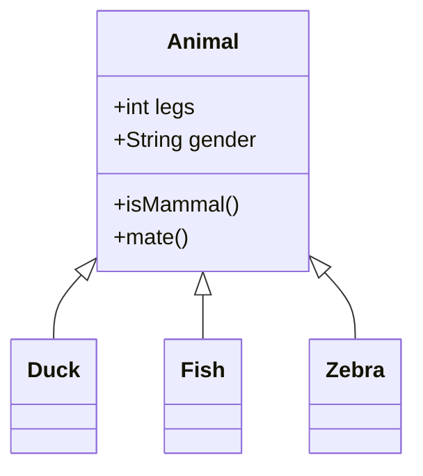

Note 1: These examples were written with VS Code that has the "Markdown PDF" extension installed. It also
can be used to preview the markdown output. Right click on the .md file tab and select "Open Preview". Test your Markdown markup also in GitHub.

Note 2: Sometimes you need more whitespace (a space, an empty line between blocks) to get some markdown markup to work

# Level 1 (=chapter) heading, with one hash

Normal text. *Italic text inside asterisk/star* 

## Level 2 (=subchapter) title, with two hashes (and so on...)

Normal text. **Strong text inside double asterisks/stars**

[Text to show on the link](https://www.w3.org/) 

## Bulleted items - unordered list with one star **and a space**

* Potato
* Carrot
* Onion

## Ordered list with just by giving all options the ordinal 1.  Easy to shuffle later!

1. ready
1. steady
1. go!

Inline code examples can be written inside backticks: `(life) => 42`

```
// code blocks with three backticks

if(true) {
    console.log('Hello, world!');
}

```


> Quotes you can add with the bigger than sign, so they look like this.


| code | country |
| :--: | :-----: |
| KEN  | Kenia   |
| FIN  | Finland |
| ABS  | Absurdia |

<details><summary>Summary visible for hideable Details</summary>

Hideable showable text for details.

More text for details.

</details>

<hr />


<hr />

Look into the *Markdown* source code for how to add images linked from internet, this is the general architecture of the Finnish Finna service: 


Note: You can invoke the list of the other files in VS Code when you type ctrl+space or type in the dot/"the full stop" character  .

Three ways to write the Horizontal rule:
<hr />

---

***

This is how you can create the ...

**Table of Contents**

[Level 1 (=chapter) heading](#level-1-chapter-heading-with-one-hash) <br />
[Level 2 (=subchapter) title](#level-2-subchapter-title-with-two-hashes-and-so-on) <br />
[Bulleted items - unordered list with one start and a space](#bulleted-items---unordered-list-with-one-star-and-a-space) <br />

Open the markdown file in GitHub.com and use it to copy the link that you need in creation of the table of contents,
just keep the part starting with the #

### Link to second file in same folder
[Link to the second file](README.md)


## One "official" source for markdown syntax

[CommonMark.org Markdown in 60 seconds](https://commonmark.org/help/)

[CommonMark.org Markdown tutorial in 10 minutes](https://commonmark.org/help/tutorial/)
